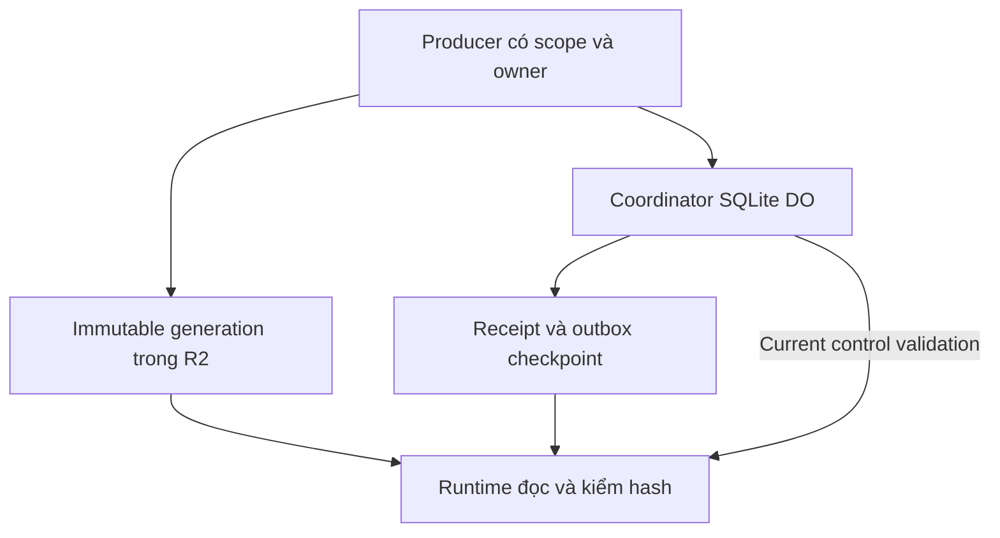

# Kiến trúc đã khóa

Authority là đúng Coordinator được locator mapping versioned xác định. R2 có blob không chứng minh commit. SQL transaction cập nhật active ref, command dedup, audit và outbox cùng nhau. Export thất bại không rollback authority. Signed checkpoint dùng để đọc fallback; fallback không tự cấp quyền positive khi thiếu current control validation.

Exact locator gồm account/environment/dataset/authority ID/locator version/locator artifact hash/namespace/native ID/object name/recovery generation. Đổi namespace/locator phải explicit authority migration; đổi tên/config bình thường không được sinh authority mới cùng dataset. Signing trust gắn toàn tuple.

Evidence là claim nguồn có thời gian/provenance. Assertion là claim đã normalize theo entity/location/scope/version. Canonical generation là output immutable trước commit. Publication revision nằm trong receipt. Fact và recommendation riêng; marine recommendation không tự sửa ferry operational fact. Source freshness không được nâng chỉ vì re-fetch hoặc regenerate dashboard.

## Ranh giới thực thi

- Repo làm việc duy nhất cho task code hiện tại: `openpq-intelligence`, nhánh độc lập từ latest main.
- F01 inventory được đọc repo khác; tuyệt đối không write, cherry-pick/reset/stash hoặc sửa PR của luồng khác.
- Không force push/rewrite history. Kiểm working tree, open branches/PR trước write; file có parallel owner thì dừng riêng file đó và chọn task độc lập.
- Local tests không cần cloud secrets. P1-P3/G1 cloud proof chỉ dedicated test account/bucket/namespace/routes/capabilities đã inventory. Production overlap hoặc unknown thì BLOCKED trước test.
- Không xóa blobs/lifecycle, tự cron, tự restore/import, mở production gate, giảm scope preflight, sửa trust/locator/signing để làm test xanh.
- Không biến JoTrip Ops thành command plane. Không sửa public/specialized UI trong task này.
- Reference V2.1 và các evidence snapshots đã pin là bất biến. Ghi kết quả mới vào thư mục mới.

## Bản đồ code

| Vùng | File | Luồng free |
|---|---|---|
| Publication authority | `src/workers/coordinator.js`, `core.js` | Chỉ đọc trong F01/F02/F03; thay đổi cần task riêng và protocol tests |
| Runtime/trust | `src/workers/runtime.js`, `src/platform/receipts.js`, `auth.js`, `s3-reader.js`, `serving.js` | Chỉ đọc, không làm tiện tay |
| Semantic fixture validators | `src/contracts/semantic.js` | F03 có task scope riêng; chưa live-integrated |
| Fixture input builder | `src/fixtures/semantic.js` | F02 được đọc; không thay semantics để khớp expected |
| Synthetic corpus | `fixtures/semantic/corpus.json` | F02 được thêm case mới, giữ case cũ |
| Corpus runner/tests | `scripts/replay-semantic.js`, `tests/semantic*.test.js` | F02 thêm expectations/tests; sửa logic runner chỉ khi có bug cụ thể |
| Reference | `docs/reference/v2.1/**` | Cấm sửa |
| Evidence đã pin | `docs/evidence/cloud-*`, `r2-revocation-*` | Cấm sửa; new evidence directory only |
