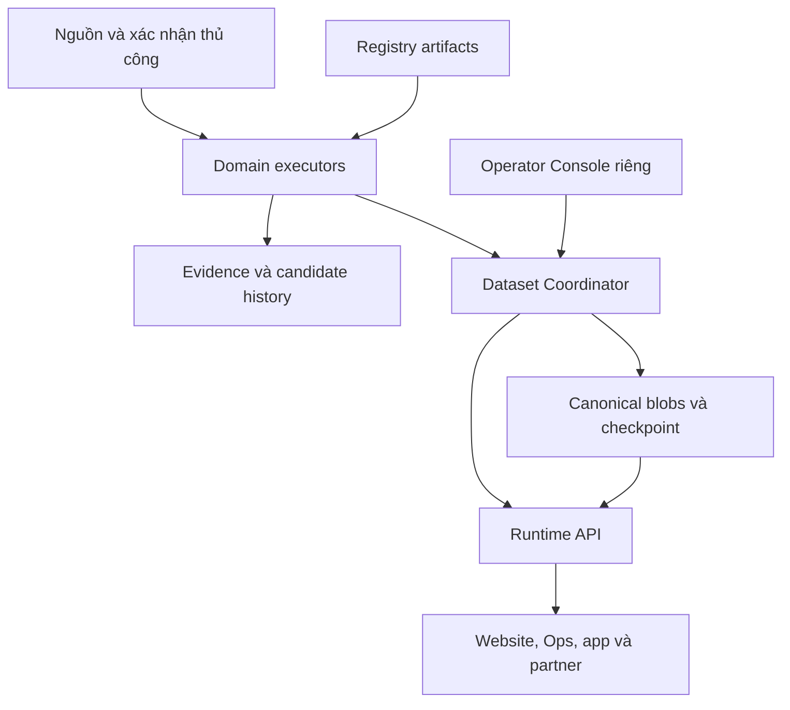

# Kiến trúc master V2.1

## 1. Mục tiêu và ranh giới

Một logical brain là tập contracts, policies, lineage và publishing authority nhất quán. Không phải một process, một Worker, một schema hoặc một global safety flag.

Domain owns knowledge: Weather, Marine, Aviation, Transit, Cano Operation. Marine có thể là module riêng trong domain package Weather nếu inventory chứng minh phù hợp; không bắt tách service. Tên dataset trong gói là logical proposal, chưa xác nhận mapping path/repo thật.

Consumers: OpenPhuQuoc, specialized pages, JoTrip Ops, app/partner/AI tương lai. Consumer chỉ dùng published API. Authoring CMS nội dung có thể tiếp tục chạy riêng; nội dung editorial không tự thành operational truth.

## 2. Quan hệ thành phần

Sơ đồ là trách nhiệm logic. Core bao gồm executors, decision composition, publication control. Runtime là deployment độc lập. Coordinator có storage riêng và không bị tắt chỉ vì executor deployment bị lỗi. Đường dữ liệu raw không qua Runtime.

## 3. Baseline vật lý cho implementation prototype

| Phần | Baseline | Vì sao tồn tại |
|---|---|---|
| Contracts/domain kernels | Modules/package trong core repo mới, portable pure logic | Giữ semantics và kiểm thử độc lập |
| Executors | Worker(s), tách theo dependency, budget và secret khi cần | Domain failure/secret isolation |
| Coordinator | SQLite-backed Durable Object instance theo dataset | Authority + active reference commit nguyên tử |
| Evidence/candidate | Private object store, phân vùng quyền thực tế theo domain | History/provenance và cô lập collector |
| Canonical | Private R2 bucket riêng, publisher là writer duy nhất | Complete generations, Runtime LKG |
| Runtime | Worker deployment riêng, S3 Object Read only cho canonical | Không có quyền sửa canonical |
| Triggers | Cadence/event/manual, dùng cùng contract | Không lost required work khi missed ticks |
| Operator | Private Console/API riêng với auth và audit | Không biến Ops thành người ghi canonical |
| Sentinel/backup | Kênh riêng được chọn ở gate | Phát hiện progress outage và phục hồi |

DO/R2 là default đã chọn cho prototype, không phải bắt mọi executor chạy cùng cơ chế. Nếu primitive/cost/limits thất bại proof gate, thay adapter và cập nhật ADR, giữ invariant. Không dựng D1 chỉ để trùng control data. D1 có thể dùng cho read analytics sau này, không authority trong V1.

## 4. Data flow

Evidence receipt -> typed assertions -> normalization/identity/time mapping -> quality/completeness checks -> scoped resolution -> deterministic domain decision -> prepared canonical generation -> Coordinator commit -> Runtime serving view -> consumers.

Một executor có thể làm nhiều bước trong một run. Không yêu cầu một network hop giữa mỗi bước. Assertion/normalization order tùy source adapter nhưng không được mất raw provenance hoặc source semantics.

Composition chỉ đọc published domain refs qua internal contract, không gọi hidden weather/transit kernels trực tiếp. Kết quả composition là dataset riêng, có authority, lineage, validity và decision gates riêng.

## 5. Control plane phân chia

Transactional state mỗi dataset: recovery generation, epoch/owner, publication revision, active pointer, control revision, activated artifact hashes, active override revisions, freeze state, promotion audit và export outbox.

Scheduler state: required slots, leases và watermarks theo domain/dataset. Không được đổi active pointer từ scheduler. Source budgets/circuit state có owner theo source; nếu nhiều executors chia source credential, budget phải được phối hợp, không nhân quota theo process.

Observability metadata có thể bất đồng bộ. Không chặn canonical promotion chỉ vì dashboard analytics thất bại. Audit bắt buộc cho authority/operator changes phải commit cùng thay đổi liên quan; export audit có thể retry.

## 6. Kiểu độc lập được cam kết

- Tắt UI không tắt Core/Runtime.
- Tắt executor không xóa last canonical; Runtime tuổi hóa dữ liệu.
- Tắt Runtime không tắt collection/commit.
- Tắt một source không chuyển service state thành cancelled và không chặn domain khác.
- Tắt legacy lab chỉ được gọi là độc lập nếu producer mới vẫn thu thập và phát hành qua cycle thật.
- Control/provider/storage failure có thể ảnh hưởng nhiều domain; được xử lý bằng fail-closed promotion và recovery, không che bằng topology.

## 7. Mở rộng

Thêm domain bằng dataset/source/entity/policy contracts mới. Không sửa unrelated domain code. Entity namespaces và tenant/access scopes tồn tại từ V1, dù chưa có partner dashboard. Inventory/pricing giữ offer-specific scope; không ép mọi seller vào một giá hay availability global. Road traffic/crowds cần coverage/sampling, AQI cần averaging/index standard, events cần occurrence/timezone. AI chỉ giải thích và đọc decisions có validity.

## A001 - Authority locator

Authority tuple phải gồm environment/dataset + authority_instance_id/native DO ID/namespace identity + authority_locator_version/artifact hash + recovery_generation. Mapping versioned deterministic, một current locator mỗi dataset/environment; rename display label không đổi dataset ID. Lookup mismatch fail closed. Đổi locator là explicit authority migration theo A001, không config edit thông thường. Runtime/receipt/capability cùng ràng tuple và key scope; wrong-instance publication không được tin như current. Xem `18_AMENDMENT_A001_HARDENING.md`.
