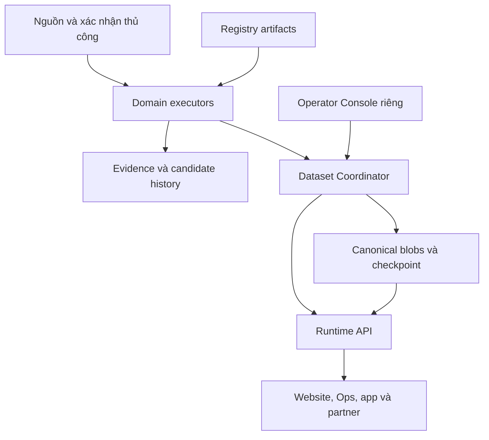

# OpenPQ Intelligence - Final Design V2.1 Complete

Ngày 01/10/2026. ARCHITECTURE LOCKED - READY TO START P0.

19 tài liệu chính; amendment A001 áp dụng 5 hardening. Parent V2 giữ nguyên byte trong reference. Tests T01-T63 NOT RUN.

# FILE: 00_START_HERE.md

# OpenPQ Intelligence - Final Design Handoff V2.1

Ngày: 01/10/2026 | Phạm vi: thiết kế và bàn giao thực thi | Ngôn ngữ: Việt, giữ tên kỹ thuật cần thiết.

## Kết luận

**ARCHITECTURE LOCKED - READY TO START P0.** Các điểm chặn của review vòng 1 đã được xử lý ở mức thiết kế, kèm giao thức và ca kiểm chứng. Đây không phải chứng nhận production-ready: chưa kiểm tra repo, credentials, quota, tốc độ, source license hoặc chạy thử hạ tầng.

V2.1 là bản thiết kế cuối của vòng bàn giao này. Luồng tiếp theo được bắt đầu inventory chỉ đọc, thiết kế implementation và code/test cô lập theo yêu cầu của người dùng. Chỉ tích hợp nguồn thật sau các gate tương ứng. Deploy/cutover production cần chỉ thị rõ của chủ hệ thống tại luồng thực thi; gói này không tự cấp quyền thay DNS, cron, canonical đang chạy.

## Phạm vi đã khóa

- Một logical platform, authority riêng cho mỗi dataset; domain không import trực tiếp domain khác.
- Giữ các thuật toán, semantics và incident fixes đã kiểm chứng của Weather/Airport/Transit.
- Quyền active publication nằm ở Dataset Coordinator, có fencing và transaction; candidate không là canonical.
- Runtime đọc canonical, kiểm tra hiệu lực, phục vụ LKG có giới hạn; không làm một truth engine thứ hai.
- JoTrip Ops hiện là dashboard/read consumer. Không cấp lệnh vận hành cho Ops. Operator Console/API được thiết kế riêng; kết nối lại Ops chỉ khi chủ hệ thống yêu cầu sau này.
- OpenPhuQuoc public canonical vẫn là https://openphuquoc.com. CMS không được tái định nghĩa thành public origin. Không redesign specialized UI trong migration backend.

## Đọc theo thứ tự

Đọc `18_AMENDMENT_A001_HARDENING.md` ngay sau README. Đây là amendment đã được chấp nhận trong release V2.1, supersede các phần được chỉ rõ của parent V2. Parent ZIP nằm nguyên byte trong reference; hash tại `V2_PARENT_SNAPSHOT.json`.

1. `01_FINAL_REBUTTAL_AND_DECISION_LOG.md`: vì sao sửa, những tradeoff chấp nhận.
2. `02_ARCHITECTURE_MASTER_V2.md`, `03_INVARIANTS_V2.md`: cấu trúc và luật chung.
3. `04_DATA_CONTRACTS.md`, `05_AUTHORITY_PUBLICATION_PROTOCOL.md`: mô hình dữ liệu và đường commit.
4. `06_TRUTH_DECISION_COMPOSITION.md`, `07_RUNTIME_FRESHNESS_CACHE.md`: suy luận, hiệu lực và cách phục vụ.
5. `08_EXECUTION_SCHEDULING.md`, `09_OPERATOR_SECURITY.md`, `10_RECOVERY_RUNBOOK.md`.
6. `11_MIGRATION_CUTOVER.md`, `12_TEST_MATRIX_AND_GATES.md`, `13_IMPLEMENTATION_BLUEPRINT.md`.
7. `14_POLICY_REGISTER_AND_OPEN_ITEMS.md`, `15_TECHNOLOGY_ADRS_AND_SOURCES.md`.
8. `16_NEXT_THREAD_EXECUTION_PROMPT.md`: prompt có thể đưa nguyên sang luồng tiếp theo.

`OPENPQ_INTELLIGENCE_FINAL_DESIGN_V2_1_COMPLETE.md` gom toàn bộ tài liệu chính. `reference/` giữ gói V1 và review vòng 1 để truy vết, không phải authority khi mâu thuẫn với V2.1. `MANIFEST.json` chứa checksum các file; không chứa secrets.

## Thứ tự ưu tiên

Chỉ thị mới của chủ hệ thống > accepted amendment/release mới > hợp đồng V2.1 > policy đã duyệt có version > snapshots tham chiếu. Nếu implementation phát hiện primitive không bảo đảm invariant, dừng đúng gate, ghi concrete counterexample và tạo ADR/amendment mới có parent SHA, sections superseded, tests và quyết định. Không sửa đè released ZIP/manifest; không tự hạ tiêu chuẩn để deploy.

## Tuyên bố kiểm chứng

Đã thực hiện phản biện tài liệu nhiều vòng và đối chiếu primitive chính với tài liệu chính thức Cloudflare. Chưa có thử nghiệm phân tán, benchmark hoặc restore thật. Checklist chưa thực hiện vẫn để chưa đánh dấu. “Đã giải quyết trong thiết kế” không có nghĩa “test đã pass”.


---

# FILE: 01_FINAL_REBUTTAL_AND_DECISION_LOG.md

# Phản biện cuối và sổ quyết định

## 1. Vòng 1 được xử lý ở đâu

| Điểm chặn | Quyết định V2.1 | Bằng chứng cần khi thực thi |
|---|---|---|
| B1 - Epoch chưa chặn race | Coordinator commit owner/epoch/control/expected revision trong một transaction | T01-T08 |
| B2 - Slot lẫn correction/rollback | Slot nghiệp vụ riêng; publication revision riêng; correction/retraction append | T09-T13 |
| B3 - LKG giữ nhãn GO | Runtime serve view riêng, expiry và control freshness giới hạn hành động | T14-T20 |
| B4 - Hysteresis thiếu lịch sử | Prior-state/history refs bắt buộc cho stateful rule | T21-T23 |
| B5 - Composition trộn thời điểm/fact | Dependency contract, temporal/spatial fit, fact và recommendation riêng | T24-T28 |
| B6 - Operator thiếu quyền | Console/API riêng; scope, audit, concurrency, policy cho giảm bảo vệ | T29-T32 |
| B7 - Bridge bị gọi độc lập | Ba mốc migration và kill tests cập nhật qua cycle thật | T33-T38 |
| B8 - Restore làm epoch lùi | Recovery generation mới, revoke credential, restore trong isolation | T39-T44 |
| B9 - Immutable bị hiểu lưu mãi | Retention/license và replay capability rõ | T45-T48 |

## 2. Phản biện chính bản sửa

### “Chỉ cần một DO, mọi race tự hết?”

Không. External await có thể làm handler xen kẽ. V2.1 yêu cầu kiểm tra lại mọi điều kiện sau I/O trong transaction đồng bộ. Blob upload không nằm trong transaction control. Candidate được chuẩn bị trước; final commit là điểm linearization. Không dựa vào process uptime hoặc thứ tự request.

### “Hai store thì vẫn cần distributed transaction?”

Không cần two-phase commit cho V1. Blob chưa được active chỉ là candidate. Ghi blob hoàn chỉnh, kiểm tra hash, đăng ký prepared record/pin rồi transaction đổi con trỏ active. Nếu crash, trạng thái active vẫn là trước hoặc sau transaction. Blob orphan được GC có grace period. Active manifest duy nhất nằm ở Coordinator. R2 checkpoint là bản sao để đọc LKG, không được bầu writer hay tự promote.

### “Checkpoint R2 có thể chạy lùi khi hai tác vụ xuất cùng lúc?”

Có nếu ghi mù. Export dùng receipt đã commit, identity recovery-generation + revision, conditional write và kiểm tra ordinal cùng generation. Update cũ không ghi đè projection mới. Retry conflict đọc lại rồi hội tụ. Recovery dùng namespace mới và danh sách generation được deployment chấp nhận, không so UUID như số tăng dần. Runtime không gọi projection là authoritative latest khi control không kiểm chứng được.

### “Một snapshot có GO hợp lệ còn dùng được sau override mới?”

Chỉ trong giới hạn propagation được ghi rõ. V2.1 không hứa immediate global revocation qua cache. Positive recommendation/action eligibility phải có control validation hạn ngắn, revision/control stamp còn khớp và các dependency còn valid. Khi mất control, positive eligibility chỉ sống đến expiry đã cấp, sau đó abstain. Observation/display có thể tiếp tục lâu hơn nhưng nhãn thay đổi. Purge cache chỉ hỗ trợ tốc độ, không là nền correctness.

### “Manual hết TTL là mở cửa lại?”

Không. Expiry làm mất assertion/override đang dùng, không tạo bằng chứng positive. Closure có ngày mở lại dự kiến vẫn là một dự kiến, không phải open confirmation. Một closure vô thời hạn cần review_due_at; không vì thiếu reconfirmation mà tự public OPEN. Giữ last reported closure tách khỏi current confirmed operational state.

### “Nếu source phát cực trị thật, quarantine có làm bỏ cảnh báo?”

Có nguy cơ. V2.1 phân biệt structurally impossible/corrupted với plausible extreme. Extreme hợp lý được giữ như evidence có anomaly flag. Với dữ liệu chưa kiểm chứng, abstain hoặc precaution theo policy; không silently thay số bằng giá trị dễ chịu, cũng không bỏ bằng chứng nguy hiểm chỉ vì khác model.

### “Một producer/queue bị lỗi có làm domain khác treo?”

Nếu gom chung concurrency/secret/CPU có thể xảy ra. V2.1 khóa isolation budget theo domain; process riêng khi source/security/duration cần. Không một queue chung không giới hạn, không global synchronous pipeline. Coordinator sharded theo dataset. Shared account/storage/provider vẫn là correlated risk được thừa nhận.

### “Một sổ source/rule ở git thì rollback code kéo rule cũ?”

V2.1 tách artifact đã build khỏi activation record. Code rollback không đổi active rule/config. Nếu code không hỗ trợ active contract thì không cho activate code đó, hoặc thực hiện explicit rule rollback có audit trước. Hash/version không được tái sử dụng cho nội dung khác.

### “Một lần replay đủ chứng minh deterministic?”

Không. Replay phải dùng đúng input refs, history/checkpoint, mapping, policy/config, evaluation time. Cùng artifacts nhưng khác arrival history có thể khác emitted decision hợp lệ. V2.1 tái hiện đúng history đã được quyết định, hoặc đánh dấu recomputed alternative, không tráo hai loại.

### “Closure đặt trước cho chiều nay, Core chết trước giờ đó?”

V2.1 bổ sung next restrictive transition vào control metadata. Positive action validity/control stamp bị clamp đến effective_from liên quan. Khi qua thời điểm đó, Runtime không cấp stamp positive mới cho snapshot chưa recompute, dù bytes cũ vẫn active. Không dựa cron chạy đúng giờ để chặn quyết định cũ.

### “GC xóa dedup record rồi message rất cũ quay lại?”

V2.1 gắn command/job deadline và retention tối thiểu cho supported retry window. Message vượt cửa sổ reject hoặc historical handling, không tự trở thành live intent mới. Business dedup phải tồn tại qua epoch transfer; replay/recovery không phát lại notifications cũ.

### “Partial operator coverage có bị xem là incomplete generation?”

Không. V2.1 làm rõ technical completeness khác data coverage. Generation đủ envelope/references có thể chứa PARTIAL coverage được domain policy cho phép và missingness rõ. Nếu cấm mọi partial coverage, hệ thống dễ giữ một LKG nhìn đầy đủ nhưng đã lỗi thời; đó cũng là stale-as-fresh path.

## 3. Tradeoff đã chấp nhận

| Tradeoff | Chọn V2.1 | Giới hạn |
|---|---|---|
| Control unavailable | Dừng promotion, bounded LKG reads | Không có continuous fresh truth khi control down |
| Một provider V1 | Cloudflare baseline, portable artifacts/interfaces | Không active multi-cloud; provider outage có thể unavailable |
| Cache và revocation | Bounded validation lifetime | Không guarantee thu hồi tức thì trên client offline |
| Cross-domain state | Exact refs + skew/validity contracts | Không global atomic snapshot mọi domain |
| Raw retention | Tuân quyền nguồn, replay có giới hạn | Không hứa replay đầy đủ sau khi evidence hết hạn |
| Domain autonomy | Cadence/executor/budget riêng | Shared platform outage vẫn có thể ảnh hưởng nhiều domain |
| Manual operations | Quyền có scope, giảm bảo vệ kiểm soát hơn | Không thêm approval hai người cho mọi thao tác thường ngày |

## 4. Cơ hội giản lược đã thực hiện

- Registry bắt đầu bằng versioned artifacts; chưa làm CMS cho registry.
- Không thêm message bus cho từng tầng xử lý.
- Không thêm global gateway hoặc database analytics vào critical path.
- Incidents/telemetry không bị ép dùng transaction chung với authority.
- Không đưa booking, payment hay lệnh AI vào V1.
- Ops không là control plane; chỉ thiết kế Operator API/Console tối thiểu riêng.
- Hysteresis chỉ áp dụng rule thực sự cần, không mọi trạng thái.

## 5. Kết luận vòng cuối

Không còn mâu thuẫn kiến trúc đã biết trong phạm vi tài liệu sau khi áp dụng hợp đồng V2.1. Các unknown còn lại là inventory, giá trị policy nghiệp vụ và khả năng primitive thực tế. Chúng có gate chặn cụ thể, không bị che bằng lời “sẽ xử lý sau”. Có thể đi sang thiết kế implementation; chưa được bỏ qua test hay coi hệ thống đã production-ready.


## Amendment A001 - 5 hardening được chấp nhận

Coordinator locator, parallel-work safety lock, isolation capabilities, revocation deny probes và immutable handoff lineage đã được áp dụng trong V2.1. Counterexamples/sections superseded chi tiết tại `18_AMENDMENT_A001_HARDENING.md`. Đây là bổ sung bảo đảm implementation, không thay kiến trúc tổng thể. Không tiếp tục tìm framework tốt hơn khi chưa có counterexample thật.


---

# FILE: 02_ARCHITECTURE_MASTER_V2.md

# Kiến trúc master V2.1

## 1. Mục tiêu và ranh giới

Một logical brain là tập contracts, policies, lineage và publishing authority nhất quán. Không phải một process, một Worker, một schema hoặc một global safety flag.

Domain owns knowledge: Weather, Marine, Aviation, Transit, Cano Operation. Marine có thể là module riêng trong domain package Weather nếu inventory chứng minh phù hợp; không bắt tách service. Tên dataset trong gói là logical proposal, chưa xác nhận mapping path/repo thật.

Consumers: OpenPhuQuoc, specialized pages, JoTrip Ops, app/partner/AI tương lai. Consumer chỉ dùng published API. Authoring CMS nội dung có thể tiếp tục chạy riêng; nội dung editorial không tự thành operational truth.

## 2. Quan hệ thành phần



Sơ đồ là trách nhiệm logic. Core bao gồm executors, decision composition, publication control. Runtime là deployment độc lập. Coordinator có storage riêng và không bị tắt chỉ vì executor deployment bị lỗi. Đường dữ liệu raw không qua Runtime.

## 3. Baseline vật lý cho implementation prototype

| Phần | Baseline | Vì sao tồn tại |
|---|---|---|
| Contracts/domain kernels | Modules/package trong core repo mới, portable pure logic | Giữ semantics và kiểm thử độc lập |
| Executors | Worker(s), tách theo dependency, budget và secret khi cần | Domain failure/secret isolation |
| Coordinator | SQLite-backed Durable Object instance theo dataset | Authority + active reference commit nguyên tử |
| Evidence/candidate | Private object store, phân vùng quyền thực tế theo domain | History/provenance và cô lập collector |
| Canonical | Private R2 bucket riêng, publisher là writer duy nhất | Complete generations, Runtime LKG |
| Runtime | Worker deployment riêng, S3 Object Read only cho canonical | Không có quyền sửa canonical |
| Triggers | Cadence/event/manual, dùng cùng contract | Không lost required work khi missed ticks |
| Operator | Private Console/API riêng với auth và audit | Không biến Ops thành người ghi canonical |
| Sentinel/backup | Kênh riêng được chọn ở gate | Phát hiện progress outage và phục hồi |

DO/R2 là default đã chọn cho prototype, không phải bắt mọi executor chạy cùng cơ chế. Nếu primitive/cost/limits thất bại proof gate, thay adapter và cập nhật ADR, giữ invariant. Không dựng D1 chỉ để trùng control data. D1 có thể dùng cho read analytics sau này, không authority trong V1.

## 4. Data flow

Evidence receipt -> typed assertions -> normalization/identity/time mapping -> quality/completeness checks -> scoped resolution -> deterministic domain decision -> prepared canonical generation -> Coordinator commit -> Runtime serving view -> consumers.

Một executor có thể làm nhiều bước trong một run. Không yêu cầu một network hop giữa mỗi bước. Assertion/normalization order tùy source adapter nhưng không được mất raw provenance hoặc source semantics.

Composition chỉ đọc published domain refs qua internal contract, không gọi hidden weather/transit kernels trực tiếp. Kết quả composition là dataset riêng, có authority, lineage, validity và decision gates riêng.

## 5. Control plane phân chia

Transactional state mỗi dataset: recovery generation, epoch/owner, publication revision, active pointer, control revision, activated artifact hashes, active override revisions, freeze state, promotion audit và export outbox.

Scheduler state: required slots, leases và watermarks theo domain/dataset. Không được đổi active pointer từ scheduler. Source budgets/circuit state có owner theo source; nếu nhiều executors chia source credential, budget phải được phối hợp, không nhân quota theo process.

Observability metadata có thể bất đồng bộ. Không chặn canonical promotion chỉ vì dashboard analytics thất bại. Audit bắt buộc cho authority/operator changes phải commit cùng thay đổi liên quan; export audit có thể retry.

## 6. Kiểu độc lập được cam kết

- Tắt UI không tắt Core/Runtime.
- Tắt executor không xóa last canonical; Runtime tuổi hóa dữ liệu.
- Tắt Runtime không tắt collection/commit.
- Tắt một source không chuyển service state thành cancelled và không chặn domain khác.
- Tắt legacy lab chỉ được gọi là độc lập nếu producer mới vẫn thu thập và phát hành qua cycle thật.
- Control/provider/storage failure có thể ảnh hưởng nhiều domain; được xử lý bằng fail-closed promotion và recovery, không che bằng topology.

## 7. Mở rộng

Thêm domain bằng dataset/source/entity/policy contracts mới. Không sửa unrelated domain code. Entity namespaces và tenant/access scopes tồn tại từ V1, dù chưa có partner dashboard. Inventory/pricing giữ offer-specific scope; không ép mọi seller vào một giá hay availability global. Road traffic/crowds cần coverage/sampling, AQI cần averaging/index standard, events cần occurrence/timezone. AI chỉ giải thích và đọc decisions có validity.


## A001 - Authority locator

Authority tuple phải gồm environment/dataset + authority_instance_id/native DO ID/namespace identity + authority_locator_version/artifact hash + recovery_generation. Mapping versioned deterministic, một current locator mỗi dataset/environment; rename display label không đổi dataset ID. Lookup mismatch fail closed. Đổi locator là explicit authority migration theo A001, không config edit thông thường. Runtime/receipt/capability cùng ràng tuple và key scope; wrong-instance publication không được tin như current. Xem `18_AMENDMENT_A001_HARDENING.md`.


---

# FILE: 03_INVARIANTS_V2.md

# Invariants V2.1

Các invariant V1 được bảo tồn với phần làm rõ dưới đây. Khi có mâu thuẫn, cách diễn đạt V2.1 là authority.

## Dữ liệu và bằng chứng

1. Missing không thành zero; unknown không thành safe; source outage không thành service cancelled.
2. Source time không bị thay bởi collection/publication time. Nhận lại bytes cũ không làm chúng fresh.
3. Model/observation/forecast/manual/official operational report là các loại assertion riêng.
4. Spatial scope, time interval, unit, horizon và source namespace phải rõ; không interpolate/merge lén.
5. Newer không mặc định better. Raw plausible extreme không bị làm dịu hoặc xóa vì lạ.
6. Evidence còn lưu là bất biến; corrections append. Retention/legal deletion có tombstone đúng policy, không giả vờ giữ evidence mãi.
7. Conflict và correlation giữa nguồn được giữ; không manufactured consensus.

## Quyền ghi và publication

8. Một Coordinator authority cho mỗi dataset và active recovery generation.
9. Epoch tăng trong cùng authority history. Epoch cũ không được regain bằng restart. Recovery history mới có generation mới, không so random generation ID bằng thứ tự chữ.
10. Chỉ authenticated LIVE candidate dưới owner/epoch/control hiện tại được xét promotion. Mode là capability được xác minh, không chỉ enum client tự khai.
11. Complete immutable blob first, transaction active reference last. Partial generation không active; projection không là quyền promote.
12. Final transaction kiểm tra expected revision và mọi control versions liên quan sau mọi external I/O.
13. Publication revision tăng trong generation. Correction cùng slot được phép; obsolete normal candidate không được tự lùi nghiệp vụ.
14. Correction/retraction/authority/code/rule rollback là các hành động riêng có audit.
15. BACKFILL/REPLAY/SHADOW không có production promotion capability và không phát real-world side effects.
16. Duplicate delivery/retry không tạo promotion hoặc side effects trùng. Không hứa external exactly-once nếu provider thiếu idempotency.

## Decision và hiệu lực

17. Truth resolution, completeness, freshness và operational recommendation là các trục riêng.
18. Fact vận hành và recommendation không dùng chung một CANCEL flag không có loại.
19. High-impact positives có evidence minimum, validity và bounded control validation. Abstention là output hợp lệ.
20. Runtime không tái resolve truth; chỉ tính serving eligibility theo pinned policy và thời gian yêu cầu.
21. Historical emitted decision không đổi. Replay alternative không thay lịch sử.
22. Determinism bao gồm exact inputs, prior state/history khi cần, rule/config/mapping versions và evaluation time.
23. Island State giữ exact refs, scope, temporal fit và dependency-specific validity; fresh publication không làm inputs fresh.
24. AI không là production resolver, rule activator hoặc action executor V1.

## Manual, consumers và security

25. Manual assertion có actor, scope, effective interval, expiry/review policy; không globally authoritative.
26. Expiry/revocation không tạo positive fact. Mở trở lại cần evidence theo policy.
27. Changes giảm bảo vệ có quyền mạnh hơn hoặc review phù hợp; thao tác thường ngày không bị áp quy trình quá mức.
28. JoTrip Ops là read consumer ở V1. Operator control có app/API riêng.
29. Consumer không có source/promotion credentials, không import hidden truth kernels, không phụ thuộc R2 object layout.
30. Client/cache/offline không kéo dài action eligibility; không bypass expiry bằng đổi nhãn.

## Reliability và migration

31. Core/Runtime independent deployment; domain cadence/budget/secret isolation có test.
32. Control unavailable -> no new promotions; bounded LKG theo policy.
33. Health đo progress và tách source/pipeline/dataset/decision/runtime. HTTP 200 không đủ HEALTHY.
34. Restore trong isolation, fence credentials và recovery generation trước khi writers được chạy.
35. Backup không là complete trước restore drill; provider outage không được hứa zero downtime ở V1.
36. Verified legacy algorithms được inventory/golden-master/differential test trước thay thế.
37. Bridge-dependent không được gọi producer-independent; retirement chỉ sau parity, rollback và kill tests.
38. Không big-bang cutover; migration/rollback theo dataset và consumer contract.
39. Code deployment không tự đổi active rule/config hoặc authority.
40. Hạ tầng mới phải giải quyết failure mode cụ thể; không thêm service chỉ để đủ sơ đồ.


## Invariants bổ sung A001

41. Một current authority locator mỗi environment/dataset; self/runtime identity checks không tin locator fields client tự khai.
42. P0 chỉ đọc repos/resources; mọi write re-check exact main/base SHA và tránh thay đổi song song.
43. G1 primitive tests không cầm production capabilities/resources/bindings.
44. Revoke success không bằng auth deny evidence; locator/generation fencing độc lập vẫn bắt buộc.
45. Released handoff snapshot/manifest bất biến; design changes qua accepted amendment có lineage.

Chi tiết/test T59-T63 trong A001 và test matrix.


---

# FILE: 04_DATA_CONTRACTS.md

# Hợp đồng dữ liệu V2.1

Đây là semantic contract, chưa phải JSON Schema/code. Luồng implementation chuyển thành schema và fixtures sau inventory. Fields bắt buộc không được điền giá trị bịa nếu nguồn không cung cấp; dùng missing reason và provenance.

## 1. Các identity riêng

| Identity | Ý nghĩa |
|---|---|
| source_id + source_namespace | Nguồn và không gian ID của nguồn |
| entity_id + entity_version | Thực thể canonical và mapping version |
| location_id + location_version | Điểm/geometry và scope bất biến của version |
| evidence_id | Receipt của payload/assertion nguồn, không là state |
| run_id | Một execution attempt |
| collection_job_id | Dataset/source + slot + mode + request intent |
| candidate_id + candidate_digest | Kết quả compute chưa được publish |
| decision_id | Một emitted hoặc replay decision, loại phân biệt |
| recovery_generation + publication_revision | Identity/order của publication đã commit |
| command_id | Idempotency cho operator/control command |

Không dùng cùng một ID cho run, evidence và logical publication. Transport retry của một command giữ command_id; sửa command body phải dùng ID mới. Cùng ID khác digest là conflict, không idempotent success.

## 2. Source registry artifact

source_id, provider, domain, source_type, namespaces, geography/scope, timezone, cadence, expected_latency, unit/interval semantics, payload_mode, auth_class, credential_reference, quality dimensions, upstream_origin/fallback_group, license/access/redistribution/retention policy, max requests/concurrency/retries/payload, timeout, redirect allowlist và artifact version/hash.

Credentials chỉ là reference, không values. Không log Authorization/query token/cookie. Kiểm soát redirect và payload limit tại adapter để tránh lộ secret và unbounded source response.

payload_mode: FULL_SNAPSHOT, DELTA, EVENT_STREAM. FULL_SNAPSHOT chỉ diễn giải “missing” nếu source bảo đảm completeness và phạm vi ngày/tuyến/entity của snapshot. DELTA missing không là xóa. Deletion/cancellation cần tombstone/event hoặc semantics rõ.

## 3. Evidence receipt

evidence_id, source_id, source_type, source_entity_id, request fingerprint đã loại secrets, observed payload hash, payload ref hoặc raw_storage_denied, source_time/source_time_basis, collected_at, received_at, source valid interval nếu có, collector/adapter version, source registry version, HTTP/result metadata đã sanitize, retention class, access scope, provenance refs.

Hash bytes giống nhau có thể có nhiều receipts: receipt mới không làm observed value/time mới. Source explicitly reconfirms unchanged operational fact khác việc cache trả lại payload cũ; adapter phải ghi confirmation semantics nếu hợp đồng nguồn cho phép. HTTP Date không tự là observation time.

## 4. Assertion

assertion_id, evidence_ref, subject/entity/location refs, variable/predicate, value hoặc missing_reason, unit, measurement/aggregation interval, source class, valid_from, valid_to, model_cycle/forecast_horizon nếu có, mapping versions, issued_at/source_time, quality dimensions, anomaly flags, supersedes/retracts nếu có, author/operator reference cho manual.

Observation, forecast, official report và manual confirmation là claim types riêng. Một manual override policy không được đổi source attribution của model.

## 5. Identity/location

Canonical identity mappings giữ source namespace, source ID, aliases, valid interval, mapper version và ambiguity state. Ambiguous match -> unresolved, không nối nhầm flight/tàu chỉ để đầy bảng.

Flight instance không chỉ là flight number: phải có operating/marketing relation, origin/destination, service date/time scope theo source semantics. Ferry trip có operator/route/day/departure và source identity; đổi giờ không được tạo trip giả hoặc bỏ trip cũ không có supersedes.

Location gồm point/geometry, CRS hoặc lat/lon interpretation, scope và version. Gió/sóng dùng cùng tọa độ theo rule đang được kiểm chứng; nếu khác phải ghi explicit spatial relation và decision abstention/tolerance policy. Không silently ghép marine point này với wind point khác.

## 6. Time model

Canonical instants UTC; operational day Asia/Ho_Chi_Minh. Khoảng hiệu lực là half-open [valid_from, valid_to). 00:00 ngày sau không thuộc ngày trước. Naive source timestamps chỉ normalize sau khi biết timezone; ambiguous -> flagged, không tự đoán.

source_time, received_at, collected_at, normalized_at, evaluated_at, published_at, served_at là riêng. Forecast model_cycle không là forecast target time. accumulation_start/end không thay bằng label giờ đơn lẻ.

Future timestamp vượt accepted clock skew bị flag; không tính source_age âm rồi gọi rất fresh. Runtime dùng server clock với skew policy; client lấy server time/remaining lifetime, dùng monotonic elapsed khi có, hết thời hạn conservative nếu clock bất thường hoặc app resume quá lâu.

## 7. Canonical generation envelope

dataset_id, contract/schema version, generation_id, content hash, candidate digest, source/evidence/input refs, semantic slot/order metadata, evaluation time, prior state/history ref nếu rule stateful, source/identity/location/adapter/resolver/rule/config/policy artifact hashes, data access/retention class, generation payload refs, dependency manifest và quality axes.

Prepared generation chưa có committed publication revision. Revision và authority commit thuộc receipt trong Coordinator, tránh sửa immutable blob để thêm số sau commit. Runtime kết hợp generation + receipt, không coi generation có mặt trong R2 là đã published.

Quality axes độc lập:

| Trục | Ví dụ |
|---|---|
| completeness | COMPLETE / PARTIAL / INSUFFICIENT |
| resolution | RESOLVED / CONFLICTING / UNCERTAIN / INSUFFICIENT_EVIDENCE |
| pipeline_at_generation | HEALTHY / DEGRADED |
| freshness_at_serve | FRESH / AGING / STALE / EXPIRED / UNKNOWN |
| current_authority_check | VERIFIED / UNVERIFIED |
| decision_eligibility | ELIGIBLE / ABSTAIN / EXPIRED / REVOKED / UNVERIFIED |

Một field có thể resolved nhưng stale; một dataset có thể fresh nhưng conflicting. Không gom vào single READY enum. Data values/source times là phần immutable; freshness_at_serve là serving view không sửa lịch sử.

## 8. Publication receipt và control validation

Receipt: dataset, recovery_generation, revision, generation ref/hash, previous receipt ref, owner/epoch, control revision, committed_at, command/candidate digest, operation kind, supersedes/retracts, audit ref, activation hashes. Coordinator là nơi xác nhận commit.

Validation stamp: dataset, generation/revision, current control revision, validated_at, validation_expires_at, policy hash và revoked/frozen indicators. Runtime không được cấp stamp nếu control không xác nhận; reusing stamp không thay validated_at.

## 9. Decisions

decision_id, decision_type, kind FACT/RECOMMENDATION, scope, emitted/replay kind, generated_at/evaluation_time, valid_from/to, action_until, evidence quality, reason_codes, minimum-evidence verdict, input refs, dependency refs, rule/config/mapping/policy hashes, prior state/history/checkpoint reference khi cần.

Decision types có domain namespace. marine.recommendation.CANCEL không tự là ferry.operational.CANCELLED. Reason codes dùng cho UI explanation; code không là bằng chứng mới.

## 10. Retention/replay capability

Mỗi output có retention/access policy. Replay capability: FULL_INPUTS_AVAILABLE, DERIVED_ONLY, PARTIAL_INPUTS, NOT_REPRODUCIBLE. Evidence tombstone giữ reason/time/hash nếu được phép. Không xóa đầu vào đang cần cho active contract trước khi tạo bản thay thế/degrade hợp lệ; quy định pháp lý bắt buộc xóa vẫn ưu tiên, khi đó data/decision eligibility bị invalidated.

Normalized/derived storage không tự có quyền giữ lâu hơn raw. Public schema chỉ expose fields được redistribution; private partner/tenant facts tách scope và credentials.


## A001 - Locator fields

Control state, publication receipt, validation stamp, command/capability và trust config thêm environment_id, authority_instance_id, authority_locator_version, locator_artifact_hash và expected native instance identity. Authority identity/locator khác recovery_generation và epoch: đổi generation không tự chọn namespace mới; đổi namespace cần migration mapping riêng. Signing key authorization gắn tuple, không chỉ dataset_id. Exact self/native identity do adapter runtime/deployment xác minh. Fields/refactors schema có version mới và compatibility gate; không giả là schema V2 đã triển khai.


---

# FILE: 05_AUTHORITY_PUBLICATION_PROTOCOL.md

# Giao thức authority và publication

## 1. Điểm linearization duy nhất

Mỗi dataset có một Coordinator state. Active reference, authority, control revision, idempotency result, audit và export-outbox entry được thay đổi cùng một transaction local. R2 không là nơi bầu authority. Không distributed transaction DO-R2, không hai active manifests cùng quyền.

State tối thiểu:

dataset_id; accepted recovery_generation; owner; authority_epoch; publication_revision; control_revision; active_receipt; previous_receipt refs; freeze/activation/override metadata; prepared records/pins; command/candidate deduplication; export outbox.

## 2. Identity/capability

Caller authenticated theo service/operator identity. Token/capability ràng dataset, mode, owner, epoch và recovery generation. Runtime có quyền read/validate, không command credential. SHADOW/BACKFILL/REPLAY không thể đổi mode thành LIVE bằng đổi JSON. Legacy writer không có canonical bucket credential và không có quyền bypass Coordinator.

Không cấp publisher signing/admin secrets cho collectors. Domain credentials chỉ đọc/ghi evidence-candidate storage được phép; publisher alone ghi canonical. Nếu lựa chọn R2 binding không hạn chế prefix, dùng bucket/capability phù hợp thay vì hứa prefix ACL không tồn tại.

## 3. PREPARE

1. Executor nhận control snapshot/artifact versions, chạy compute và gửi candidate refs + digest.
2. Publisher xác minh caller/mode, allowed schema, source/evidence dependencies, completeness theo policy, scope/order và size limits. Kiểm tra anomalies không đồng nghĩa từ chối mọi extreme.
3. Publisher đọc candidate bytes, xác minh hashes và ghi complete immutable generation vào canonical namespace bằng create-if-absent. Không cho executor ghi trực tiếp canonical.
4. Verifying read/checksum và full dependency manifest hoàn tất trước đăng ký PREPARED. Record có prepare deadline, candidate digest và pin để GC không xóa trong commit window. Nếu crash trước PREPARED, chỉ là orphan theo grace policy.
5. Không trả trạng thái committed ở bước này.

External I/O có thể interleave. Mọi checks có thể thay đổi sau I/O phải được kiểm tra lại ở COMMIT. Không giữ SQL cursor qua await. Transaction không chứa upload/fetch.

“Complete generation” nghĩa là envelope, manifest và các references bắt buộc hoàn chỉnh về kỹ thuật. Payload có coverage PARTIAL vẫn được phát hành nếu domain policy cho phép và ghi missingness rõ. Không từ chối mọi partial coverage rồi giữ LKG trông như đầy đủ. Không trộn hai nghĩa completeness này.

## 4. COMMIT

Request chứa command_id, candidate digest, expected active revision, expected control revision, owner, epoch, recovery_generation, prepared ref và operation kind.

Trong transaction đồng bộ:

- Nếu command_id đã commit cùng digest -> trả đúng receipt cũ. Digest khác -> reject conflict.
- Kiểm tra accepted generation và authenticated capability; caller LIVE có quyền dataset này.
- Owner/epoch/control_revision/expected_active_revision phải khớp current state.
- Prepared record còn tồn tại, chưa expired, đúng digest/hash; artifacts được phép và field-level candidate prerequisites đã verified.
- Freeze/publication restrictions không cho phép normal promotion. Retraction/degrade bởi operator được phép riêng theo command policy, không implicit bypass.
- Slot/order acceptable cho operation; normal obsolete candidate reject. Correction/retraction dùng explicit supersedes/reason/permission.
- Decision/evidence validity vẫn phù hợp commit time; positive candidate đã hết action validity không được active như eligible.
- Với stateful output, prior state reference phải khớp state/revision yêu cầu, không bỏ qua một transition mới.
- Cấp revision +1, tạo receipt, thay active ref, audit và outbox; resolve pin state thành retained committed ref.

Response chỉ sau durable commit confirmation; không cấu hình allowUnconfirmed cho đường này. Expected revision mismatch -> RECOMPUTE_REQUIRED hoặc revalidate/rebase theo pure deterministic contract; không đổi expected revision rồi gửi lại candidate stale một cách mù.

Domain admissibility về slot/order dùng pure typed policy interface được version hóa; Coordinator không có chuỗi if domain toàn cục. Checks đồng bộ trong transaction chỉ dùng metadata/policy đã nạp được kiểm chứng, không fetch hoặc chạy heavy domain compute.

## 5. Command thay đổi authority/control

Authority transfer/revoke/freeze/rule activation/override changes dùng command_id và expected control revision; kiểm tra quyền, scope, effective time và audit trong cùng transaction. Authority transfer epoch +1, không tự thay active payload. Control revision tăng; candidates computed từ revision cũ bị reject. Các dataset sử dụng chung artifact kích hoạt theo từng dataset; không cần global multi-DO transaction.

Override có expiry; Runtime không coi expired override-based positive còn eligible. Việc expired không tự thay truth payload; Core recompute sau đó. Gate cuối kiểm tra effective interval và control changes theo nguồn thời gian server.

Future-effective restrictive commands phải có next_transition_at. Candidate positive và validation stamp không sống quá transition liên quan, dù Core không chạy lại đúng giờ. Đến transition, old output action-ineligible cho đến recompute đủ evidence. Không cần timer chạy đúng mili giây để bảo vệ expiry.

## 6. EXPORT và LKG checkpoint

Sau commit, outbox retry ghi immutable receipt và projection LKG vào R2. Receipt export phải được publisher attested theo signing/key policy hoặc một cơ chế integrity equivalently verified; read-only Runtime xác minh receipt identity/hash, không chỉ tin filename. Chọn ký receipt ở baseline để checkpoint đọc khi control down có provenance kiểm chứng được. Key IDs/version và public verification keys nằm trong deployed trust config; signing secret chỉ publisher.

Projection là cache của committed receipt, không quyền promotion. Conditional write theo object ETag; chỉ replace cùng recovery generation khi receipt revision lớn hơn. Failed CAS -> reread/retry có budget. Generation mới dùng namespace projection mới; Runtime chỉ đọc generation trong trust config hiện hành. Không so UUID để chọn latest.

Nếu export trễ, Runtime bình thường đọc Coordinator active ref rồi lấy blob. Nếu Coordinator down, dùng checkpoint đã verified, ghi authority UNVERIFIED và tuổi thật. Checkpoint không cấp control validation mới hoặc positive eligibility mới. Có thể không có LKG trên cold start nếu commit mới chưa export; chấp nhận unavailable, không list rồi lấy candidate mới nhất.

## 7. Failure table

| Crash/lỗi | Kết quả đúng |
|---|---|
| Upload chưa hoàn tất | Không PREPARED/COMMITTED |
| Blob complete, chưa prepared | Orphan; active cũ |
| Prepared, chưa commit | Pin có deadline; active cũ |
| Transaction abort | Không tăng revision; không receipt/outbox một phần |
| Commit xong, response mất | Retry cùng command/digest trả receipt đã có |
| Commit xong, export mất | Active mới tại Coordinator; outbox retry; LKG projection có thể lag |
| Freeze/epoch đổi trong upload | Final commit rejects stale control/capability |
| Runtime đọc ref nhưng blob unavailable | Retry bounded; fallback verified previous nếu policy cho phép; không partial generation |
| Candidate hash sai/missing ref | Reject/quarantine và incident; không activate |

## 8. Correction, retraction và garbage collection

Correction tạo generation/receipt mới và supersedes; bản emitted cũ vẫn là lịch sử. Retraction tạo receipt/tombstone trạng thái invalidated, action-ineligible; có thể chỉ định fallback ref với freshness thật. Không xóa bản sai rồi giả như chưa từng phát hành.

GC không được dùng lifecycle rule mù cho active canonical namespace. Dựa vào active/retained refs, prepared pins, historical retention và grace > prepare/retry window. Publisher/GC protocol phải chứng minh không xóa blob giữa prepared verify và commit. Purging lawful evidence không đảm bảo replay; invalidation/degrade cần được áp dụng theo policy.

Idempotency retention phải bao phủ supported redelivery/retry window. Command/job có deadline; message cũ vượt cửa sổ không được biến thành new live intent sau khi dedup entry bị GC. Business-event dedup cho alerts tồn tại qua epoch/cutover theo policy; recovery reconciliation không phát lại events trước checkpoint như mới.

## 9. Giới hạn bảo đảm

Fencing bảo vệ authorized writers tuân protocol và không có bypass credentials. Publisher admin compromise vẫn là nguy cơ rộng hơn; cần least privilege, deployment access và audit. Không hứa chịu được mọi privileged attacker chỉ bằng epoch. R2 content-addressed objects là application immutability, không tự là WORM backup.


## A001 - Locator admission

PREPARE/COMMIT/read-validation xác minh authority locator/environment với bootstrap trust artifact và self identity trước owner/epoch/control checks. Final transaction so locator/state/capability version; client không tự bootstrap authority instance khác. Receipt/export paths và signing key scope mang cùng authority tuple. Alternate/old namespace không được dùng fallback nếu resolver lỗi. Lookup ID deterministic theo stable dataset ID trong registered namespace; pin expected native ID, không chỉ name. Locator transfer dùng runbook A001, fence old routes/trust, một current tuple, audit và T59 proof.


---

# FILE: 06_TRUTH_DECISION_COMPOSITION.md

# Truth, decision và composition

## 1. Resolution có scope

Resolver nhận assertions theo variable/entity/location/time/horizon, policy version và evaluation time. Không universal source rank METAR > ECMWF cho mọi biến. Airport METAR chỉ là observation ở scope của nó; không biến thành weather toàn đảo hoặc forecast mọi giờ.

Policy xác định eligible evidence, precedence, spatial/temporal fit, completeness minimum và cách biểu diễn conflict. Evidence không được chọn vẫn giữ refs/reasons theo retention. Không cộng số feeds cùng upstream thành nhiều nguồn độc lập.

Anomaly handling: corrupted/structurally impossible có thể quarantine; plausible dangerous extreme giữ evidence + flag, cross-check và abstain/precaution theo policy. Missing gust không thành gust=wind hoặc zero. Weather ECMWF 3h không fake hourly interpolation; giữ legacy verified cycle/aggregation semantics.

## 2. Fact và recommendation

| World fact | Recommendation riêng |
|---|---|
| Cano được người vận hành xác nhận hoạt động hôm nay | Với điều kiện gió/sóng hiện tại, nên đi/chờ/đổi kế hoạch |
| Ferry operator thông báo trip cancelled | Dù chưa hủy, điều kiện hành trình cần lưu ý |
| Attraction có thông báo closure | Gợi ý hoạt động khác phù hợp thời gian |
| Flight report có actual/delay status | Lúc nào nên rời khách sạn/đón khách theo rule đã duyệt |

Official closure/scoped manual closure/safety recommendation là những inputs khác nhau. Positive manual confirmation không ghi đè closure chính thức trong cùng scope. Cross-domain recommendation có thể hạn chế gợi ý cano, không thay factual ferry status.

## 3. Minimum-evidence contract

Mỗi decision_type định nghĩa required variables, coverage, horizon, freshness, agreement policy, operational confirmations, absence handling và validity window. Thiếu minimum -> ABSTAIN/INSUFFICIENT_EVIDENCE. Không biến abstain thành thuận lợi bằng copy UI.

Các ngưỡng wave/gust/rain và quyết định high-impact phải lấy từ legacy rule inventory đã verified hoặc được chủ domain duyệt riêng. V2.1 không tự đặt ngưỡng an toàn du lịch/đường biển mới.

## 4. Manual validity

Cano confirmation chỉ áp dụng scope/ngày/thời gian được xác nhận, tối đa đến hết ngày vận hành khi policy cho phép. Nếu xác nhận ghi trong ngày 01/10, không carry vào ngày 02/10. Midday closure supersedes trong scope từ effective_from.

Manual statement đang có hiệu lực là evidence, không absolute truth cho mọi location/service. Override thay cách policy chọn evidence có active revision riêng. Expired assertion/override-based decision -> không còn đủ eligibility; Runtime không tự bỏ override rồi tái compute GO.

Closure vô thời hạn: valid_to có thể không xác định, review_due_at bắt buộc theo policy; last_reported_closed và confirmed_current_state tách riêng. Đến review deadline có thể giảm confirmation quality, không tự chuyển OPEN. Forecast reopening date lưu planned_reopen, không actual reopen.

## 5. Deterministic state transitions

Pure decision input = assertions/resolution refs + prior state/history/checkpoint + rule/config/mapping/policy versions + evaluation_time. Không hidden Date.now(), global mutable state hoặc external fetch trong pure kernel.

Hysteresis có entry/exit thresholds, required dwell window, missing interval behavior và late-evidence policy. Missing interval không được tính thành duration thuận lợi. Restart giữa dwell đọc checkpoint có exact state/history refs, không reset để thoát HOLD sớm.

Output emitted history và replay alternative distinct. Một source correction đến muộn có thể thay current decision bằng publication mới; replay quá khứ không sửa emitted record cũ. Same current values khác prior history có thể khác output đúng, vì inputs thực tế khác nhau.

## 6. Composition contract

Composition dataset định nghĩa evaluation scope/time, mandatory/optional input datasets/fields, allowed skew, valid intersection, freshness maximum, conflict precedence và action policy. Bắt đầu một decision cụ thể, không tạo global “island safe” flag.

Candidate composition ghi exact receipt/input refs. Domain updates không cần global lock. Nếu inputs lệch ngoài contract -> abstain/partial theo từng recommendation. Publication mới chỉ vì một dependency fresh không nâng tuổi dependencies khác.

Positive high-impact serving view cần control validation của các dependency có thể thu hồi/hạn chế quyết định, không chỉ Coordinator composition. Stamp của composition không tự xác nhận Weather/Marine/Cano vẫn current. Mỗi dependency stamp khớp ref/control state và còn hiệu lực; maximum validity là min của mọi deadline. Nếu ref đã bị retracted/superseded incompatible -> ABSTAIN cho đến recompute.

Không hứa zero-skew mọi domain: chọn bounded skew + bounded revocation latency đã được policy chấp nhận. Critical decision nếu yêu cầu real-time simultaneous state ngoài khả năng này phải không phát positive, hoặc có ADR mở rộng được duyệt.

## 7. Presentation/AI

Runtime/UI hiển thị fact, recommendation, uncertainty và thời gian cập nhật dễ hiểu. Labels domain/technical reasons có thể nằm phần chuyên sâu. Translation/AI explanation gắn decision ID và validity; không bịa lý do, không đổi “chưa xác nhận” thành “không hoạt động”. Không biến AI fallback text thành dữ liệu canonical.


---

# FILE: 07_RUNTIME_FRESHNESS_CACHE.md

# Runtime, freshness và cache

## 1. Hai lớp dữ liệu

Immutable generation/decision là điều đã phát hành với exact refs. Serving view là khả năng sử dụng tại served_at: current authority check, input ages, validity, decision eligibility, current invalidation status và fallback provenance. Serving view không sửa generation cũ và không tái resolve truth.

Runtime deployment riêng; không source credentials, không canonical write capability. Baseline đọc canonical R2 bằng S3 Object Read only, scope canonical bucket. Coordinator read/validate endpoint kiểm tra read principal; các command endpoint yêu cầu credential khác. Binding network access không đồng nghĩa quyền command.

## 2. Read flow

1. Lấy authoritative active receipt/control validation từ Coordinator hoặc sử dụng stamp chưa expired theo policy.
2. Fetch exact immutable generation bằng receipt/hash; không list storage để đoán latest.
3. Kiểm tra contract/hash/dependency refs và evaluate serving eligibility với pinned policy/server time.
4. Trả payload với metadata; không lấy missing field ở generation khác rồi giả đó là một complete generation.
5. Khi control/store lỗi, chỉ dùng verified LKG/checkpoint/cache còn được serve policy cho phép. Authority check UNVERIFIED, giữ source times và deadlines. Nếu thiếu trusted checkpoint -> unavailable.

## 3. Validity và tuổi

Mỗi field có source_time_basis và max_source_age/valid interval. Dataset summary không che field stale. Deadline serve/action dựa vào min của decision validity, required field expiry, override expiry và control validation expiry cho hành động liên quan.

Control validation mới có thể xác nhận snapshot chưa bị thu hồi; không refresh observation time. Khi source dữ liệu già đi, control healthy vẫn không làm source fresh.

Stamp còn phải kiểm tra current active ref/control revision và next scheduled restrictive transition. Validation endpoint không chỉ trả “Coordinator alive”. Snapshot bị retracted hoặc có rule/override effective transition làm nó không còn hợp lệ không được nhận stamp positive mới, dù active bytes chưa được Core thay.

Display fallback có thể tồn tại khi action eligibility hết hạn. UI phải ghi “thông tin gần nhất, chưa xác nhận hiện tại” hoặc câu phù hợp, không giữ nhãn thuận lợi/đang hoạt động như hiện thời. Source failed != world state failed.

## 4. Revocation và cache

Positive high-impact response mặc định không public shared cache; cache nội bộ của validation stamp chỉ sống đến expiry. Có thể vẫn cache immutable data bytes. Bounded propagation window trong policy là giới hạn chấp nhận, không tuyên bố immediate global revocation.

Policy proposed cho prototype: control validation lifetime tối đa 15 giây với positive high-impact, action offline grace bằng 0. Đây là mục tiêu thiết kế cần domain owner chấp nhận, không số đo đã đạt. Runtime phải dừng positive khi hết stamp, dù source data còn valid. Có thể chọn ngắn hơn hoặc no-cache nếu cần; không tăng số này lén để cải thiện latency.

Observation-only endpoints có cache ceiling riêng. Airport flight display đặt ceiling nhằm bảo đảm mục tiêu update không chậm quá 60 giây khi nguồn/cadence đáp ứng. Các số source freshness thật chốt sau baseline đo; API chưa có policy đủ thì action ABSTAIN.

Conditional GET/304 chỉ cho phép client reuse immutable bytes hoặc ETag có phục vụ metadata đúng. Không 304 một serving view cũ mà không cập nhật validity. TTL không reset khi nhận lại 304 nếu control/source stamp cũ. HTTP stale-while-revalidate/stale-if-error không được kéo dài positive action ngoài deadline.

## 5. Client/offline contract

Client nhận served_at, expires_at/action_until, control_validation_expires_at, source times và eligibility. Khách xem thông tin cũ được nếu display policy cho phép, nhưng app không được tự cấp GO từ cached bytes.

Client timeout/clock abnormal/app resume: tính conservative deadline từ server lifetime + monotonic elapsed; không tin local date bị chỉnh để mở lại eligibility. UI đang mở cũng phải refresh/expire nhãn theo timer, không chỉ khi reload. Sau recovery generation đổi, bỏ cache trust generation cũ theo config/API envelope.

Không thể cưỡng chế client độc hại không tuân contract. Partner dùng dữ liệu cho high-impact action phải chấp nhận contract và integration tests; V1 không thực hiện booking/payment nên không hứa transaction action enforcement.

## 6. Endpoint contract đề xuất

| Endpoint logic | Output | Hành vi lỗi |
|---|---|---|
| dataset snapshot | Receipt + generation + serving view | Verified aged LKG hoặc unavailable |
| domain decisions | Fact/recommendation + reason/validity | Abstain khi minimum/validation hết hiệu lực |
| island composition | Exact input set + per-recommendation state | Partial/abstain cho dependencies thiếu |
| provenance details | Refs/versions được phép xem | Không expose raw/secret trái access policy |
| health/progress | Runtime/pipeline/source/data axes | Không đánh đồng 200 với data current |

Actual paths chưa khóa để không ép storage layout thành public API. Semantic versioning cho public contract; backward compatibility cho consumer migration. Internal reader contract cũng versioned, không direct raw file assumption.

## 7. Availability giới hạn

Coordinator down + R2 alive: cold Runtime có thể đọc verified checkpoint nếu đã export, không positive validation mới. R2 down + Coordinator alive: dùng cached verified blob nếu còn trong display policy; ref alone không đủ. Cả hai down + cache cold: unavailable. Runtime down: Core vẫn update; consumers có thể hiển thị own bounded display cache theo contract.


## A001 - Current locator trust

Runtime kiểm tra environment/locator/native identity/key scope/generation/revision cho receipts/stamps, không signature alone. Current tuple duy nhất từ approved bootstrap artifact; historical keys chỉ verify lineage, không tạo current positive. Khi locator migration, drain/disable old Runtime routes hoặc chứng minh hết current-positive capability/stamps trước resume. Wrong environment/locator snapshot không là current LKG fallback; historical display chỉ nếu explicit policy và provenance cho phép, action-ineligible.


---

# FILE: 08_EXECUTION_SCHEDULING.md

# Execution, scheduling và budgets

## 1. Modes và identities

LIVE có thể submit promotion khi capability/control hợp lệ. SHADOW chỉ candidate namespace. BACKFILL ghi lịch sử trong historical namespace. REPLAY recompute alternative outputs, không gửi thông báo hoặc thay active pointer. Permissions tách theo mode, không chỉ flag truyền từ caller.

Collection identity: source/dataset + logical slot + mode + request intent. Execution attempt có run_id, authority generation/epoch và retry attempt. Evaluation identity có evidence fingerprint + rule/config/policy/prior-state refs. Publication idempotency dựa candidate/command identity, không đơn giản source slot.

Epoch thuộc execution capability; không nằm trong business dedup key duy nhất vì epoch đổi không tạo sự kiện thế giới mới. Ví dụ cùng thông báo đóng cửa không phát alert lại chỉ vì cutover epoch mới.

## 2. Scheduling và completion

Mỗi domain policy định nghĩa expected cadence, source latency, slot meaning, backlog cap và catch-up. Một logical orchestration policy không bắt một scheduler process cho mọi domain. Triggers cadenced/event/manual có thể độc lập, cùng durable job ledger semantics.

Ledger states: REQUIRED, LEASED, COLLECTED, COMPUTED, COMMITTED hoặc TERMINAL_FAILED/SKIPPED_WITH_REASON. Watermarks theo ý nghĩa: collected-through, evaluated-through, published-through không đồng nhất. Failed slot không được tăng success watermark; explicit skip obsolete được ghi riêng. Lease expired có thể retry, không xác nhận success.

Baseline persistence: slot/lease ledger gắn Coordinator hoặc control instance theo domain khi volume cần tách; shared-source budget có control instance theo quota group nếu nhiều executors dùng chung quota. Có thể dùng cùng DO technology/namespace với typed IDs, không bắt thêm database/service. Scheduler/budget instance không có quyền promote dataset khác.

Trước fetch dùng source budget; trước promotion dùng Coordinator gate. Control unavailable có thể tiếp tục collection bounded nếu allowed policy và evidence store hoạt động, nhưng không promote hoặc tích backlog vô hạn.

## 3. Catch-up theo domain

| Domain | Chính sách khởi điểm để kiểm chứng |
|---|---|
| Weather/model | Thu latest eligible model cycle; historical gaps backfill riêng; không lấy obsolete forecast làm current |
| Aviation/live | Rebuild latest live scope và reconcile late source updates; không replay mỗi poll missed như current |
| Transit/schedule | Recheck ngày thực và trip scope; bỏ obsolete query có reason; vé chỉ on-demand theo nghiệp vụ |
| Cano/manual | Chờ đúng xác nhận ngày/phạm vi; không tự replay confirmation hôm trước |
| Composition | Coalesce triggers, dùng exact admissible refs; bỏ candidate outdated bằng commit checks |

Source-specific verified semantics từ inventory có quyền ưu tiên hơn giả định bảng này sau khi được đưa vào policy version. Không dùng monthly ferry schedule thay ngày thật, không seat count bịa.

## 4. Queues/workflows

Direct Worker khi bounded duration và dependencies phù hợp. Queue khi cần async retry/load buffer/failure isolation. Workflow chỉ khi long-lived multi-step/resume cần thiết. Không chọn một cơ chế cho mọi domain từ đầu.

Queue messages có idempotency identity, slot, mode, source/candidate refs, deadline, intent và attempt. Không chứa raw secrets hoặc payload khổng lồ. Assume duplicate và out-of-order. Retry không được đổi mode; late expired jobs trở thành historical/skip theo policy, không force current.

Poison payload -> bounded retries, dead-letter/quarantine với reason, không infinite retry. Domain concurrency và source budget caps; một nguồn 429 không giữ toàn bộ consumers bận. Nếu queue dùng chung vật lý, phải chứng minh per-domain fairness/budget; nếu không, tách vì isolation cụ thể.

## 5. Circuit/budget semantics

Distinguish timeout/network/TLS/429/5xx/schema/semantic errors. Respect provider retry window; jitter/backoff bounded. Circuit CLOSED/OPEN/HALF_OPEN, half-open concurrency bounded. Budget counters owner theo source/quota group; shadow reuse evidence tránh double-fetch.

Shadow thu cùng evidence được phép dùng tạo comparison tốt hơn gọi hai thời điểm khác. Nếu cần independent collector comparison, có request budget và attribution rõ. Không vượt source permissions để đạt parity.

Max payload/redirect/timeouts/requests/concurrency/retries phải có values trong activated source policy trước live integration. Defaults conservatively bounded, không “unlimited until measured”.

## 6. Health và incidents

Run metadata: run_id/dataset/source/mode/epoch/generation, slot, scheduled/start/finish, retry_count, records_in/out, source_age, completeness, candidate digest, publish result, watermark effect và error class.

Health axes riêng; heartbeat đo last successful source collection, source progress, last semantic validation, last commit, backlog age và active snapshot/source ages. Có thể producer chạy đều nhưng source không đổi hoặc source timestamp stale; đừng gọi pipeline-good là world-fresh.

Incident key theo domain/source/failure class/scope; repeated errors update một incident. Recovery requires progress, không đóng incident chỉ vì một HTTP 200. Alerts không phát vô hạn; audit/dedup bảo tồn qua authority migration.

## 7. Side effects V1

V1 không thực hiện booking/payment hay lệnh cho partner. Monitoring alert là optional integration sau chọn kênh/người nhận có quyền. Nếu triển khai alert, outbox + business idempotency; provider thiếu idempotency có thể duplicate trong ambiguous delivery, ghi rõ thay vì hứa exactly once. Replay/shadow/backfill không dispatch.


---

# FILE: 09_OPERATOR_SECURITY.md

# Operator, security và activation

## 1. JoTrip Ops giữ read-only

Ops hiện là dashboard lấy dữ liệu vận hành. Không thêm lệnh freeze, override, rule activation, authority transfer hoặc source credential vào Ops. Operator API/Console là private surface riêng. Sau Intelligence ổn, chủ hệ thống có thể yêu cầu kết nối/thay đổi Ops bằng scope mới.

Console có auth, role/scope policy, explicit command API và append audit. Không public anonymous control endpoints. Nếu cookie auth dùng cho mutation, cần CSRF/origin protections; chọn mechanism khi implementation, không tự reuse CMS session/credentials.

## 2. Quyền theo hành động

| Role logic | Quyền điển hình | Giới hạn |
|---|---|---|
| Reader/Ops | State, health, lineage được phép | Không commands/secrets |
| Domain confirmer | Nhập observation/confirmation ngày/phạm vi được giao | Không đổi rules/authority hoặc override official closure |
| Domain supervisor | Scoped correction/override/freeze | Giảm bảo vệ theo strong policy, không global quyền mặc định |
| Platform operator | Authority/cutover/recovery theo gate | Không tự đổi domain safety thresholds |
| Deployment administrator | Deploy/configure integrations được duyệt | Quyền hạ tầng rộng là residual risk cần audit |

Roles là semantic proposal, không đồng nghĩa phải có năm người. Một người có thể nhiều role; vẫn ghi actor/action/scope. Credentials service và human riêng.

## 3. Command contract

command_id, authenticated actor/service, action, dataset/entity/location/day scope, expected control revision, effective_from, expires_at hoặc review_due_at theo type, reason, proposed change, payload digest và approval/review reference nếu policy yêu cầu.

Preview hiển thị actual local day/time, scope và tác động cụ thể. Confirm command vẫn kiểm tra quyền/concurrency; preview không là reservation. Hai người sửa cùng revision: một thành công, người còn lại nhận conflict và phải xem state mới.

Authority/override/rule command phải audit actor, before/after, effect interval, reason, control revision và commit time. Audit không chứa raw secrets hoặc PII không cần thiết. Audit export có retention policy và backup.

## 4. High-impact giảm bảo vệ

Positive override không vượt official closure. Nếu policy cho supervisor thay một automated restriction, cần quyền rõ, lý do, thời hạn ngắn và evidence; decision vẫn giữ manual override attribution. Tùy đội ngũ có second review hoặc elevated role, phải chốt trước bật feature. Khi policy chưa được duyệt, command giảm bảo vệ disabled. Không áp two-person approval cho việc xác nhận cano hoạt động thông thường.

Break-glass scoped, owner, expiry/reconfirm deadline và incident reference. Freeze expiration không mặc định tự promote candidate cũ; unfreeze chỉ cho current-valid candidate sau recompute. Rule disabled phải có fail-safe output/abstention, không “rule missing means GO”.

## 5. Rule/source activation

Artifacts: DRAFT -> SHADOW -> APPROVED -> ACTIVE -> RETIRED. Artifact bytes/hash/version immutable. Approval ghi parity/fixture results; activation tại Coordinator từng dataset có expected control revision. Có explicit compatibility matrix code/schema/rule. Code rollback không tự kích hoạt artifact cũ.

Source registry thay endpoint/scope/license/cadence là controlled change; source name không được giữ attribution nếu upstream thực tế đổi. Identity/location mapping đổi phải có version và validity. Không unrestricted CMS cho registries.

## 6. Capability isolation

- Runtime: canonical read-only, control validate/read; không source secrets và command credential.
- Executor: source credentials cần thiết, evidence/candidate quyền domain/mode; không canonical writes.
- Publisher/Coordinator: canonical write, stage reads, receipt signing, control transactions; không cần mọi source credentials.
- Operator API: delegated command credential/identity có scope; không raw R2 admin token ở frontend.
- Backup/GC: quyền riêng và retention controls; không dùng Runtime token để ghi.

Read-only phải được chứng minh bằng denied PUT/DELETE/command tests, không bằng TypeScript interface chỉ có get(). Temporary tokens/buckets có scope thật; không giả có prefix protection nếu adapter không hỗ trợ.

## 7. Partner/AI/data rights

Partner/tenant scope trong contract; public Runtime không expose giá/inventory riêng hoặc raw feed trái redistribution policy. AI tool đọc permitted decisions, không tự mutate rule/override. Thêm action plane sau này cần scope/authorization/idempotency riêng, không mượn quyền “read intelligence”.

## 8. Security residual risk

Privileged account takeover có thể xóa stores hoặc deploy publisher độc hại; epoch không giải quyết trường hợp này. Mục tiêu V1: least privilege, secrets isolation, protected deployments, audit, offsite portable restore artifacts và restore drill. Không mở thêm monitoring/backup SaaS hoặc cấp quyền ngoài phạm vi chỉ để đủ checklist.


## A001 - Environment, locator và revocation

Capabilities/signing keys có environment+authority locator scope; test principal không sở hữu production command/storage capability. Deployment preflight ghi actual resource mapping. Recovery deny probes sau revoke là gate có evidence, không suy ra đã deny từ API revoke 200. Probes chỉ disposable/side-effect-free approved path theo A001; không thử phá payload thật.


---

# FILE: 10_RECOVERY_RUNBOOK.md

# Failure matrix và recovery runbook

## 1. Trạng thái lỗi

| Lỗi | Tiếp tục | Dừng/degrade |
|---|---|---|
| Một source | Domain sources khác và unrelated domains | Source-specific coverage thiếu, circuit/retry |
| Một executor | Runtime/Coordinator khác, history | Fresh updates domain đó; bounded LKG |
| Coordinator dataset | Bounded collection và verified checkpoint reads | Promotion/authority changes; positive validation hết hạn |
| Canonical R2 | Collection nếu evidence store còn được, cached displays | New complete blob publication; cold reads có thể unavailable |
| Evidence store | Serving committed canonical | New evidence-dependent compute, không giả input |
| Runtime | Core/Coordinator update | HTTP consumers dùng bounded cache hoặc unavailable |
| Shared registry artifact missing | Already pinned artifact nếu kiểm chứng được | New activation; positive compute thiếu artifact abstain |
| Cloudflare/account outage | Offsite archived review theo kế hoạch nếu có | Có thể cả live service unavailable; V1 không active multi-cloud |
| Semantic corruption | Quarantine/cross-check, unrelated domains | Invalid candidate; nếu đã active phải retract/degrade |

Không tự fail-open khi control/storage unavailable. Không xóa canonical chỉ vì health probe fail.

## 2. Backup phạm vi tối thiểu

Portable export bao gồm: canonical generations/receipts đang cần, authority/control audit, active rule/config/source/schema/identity/location artifacts, override/freeze state, scheduler success/gap metadata, deploy/code artifact refs và evidence còn được phép giữ. Secrets khôi phục riêng từ quản lý secrets, không nhét vào backup ZIP công khai.

Không cần đồng thời point-in-time mọi store: export có refs/checksums, thời điểm, watermark và replay capability. Restore chỉ active receipt nếu mọi blob/required artifacts còn có và verified. R2 checkpoint/export outbox lag ảnh hưởng RPO, phải đo.

Backup integrity khác quyền write production. Giữ export tách khỏi same destructive credentials; cold offsite location/cadence cần chọn theo RPO/RTO gate. Nếu chưa có offsite backup, không nhận cam kết phục hồi toàn bộ account deletion. Native PITR hữu ích nhưng không thay portable restore/test và không nằm ngoài provider.

## 3. Mục tiêu phải chốt trước live

RPO/RTO cho control, canonical, evidence theo từng domain; acceptable provider-wide downtime; max detection time; backup cadence/max export lag; restore drill frequency; người sở hữu recovery và nơi giữ trust config.

V2.1 không tự hứa SLA chưa đo. Numeric values nằm policy register: chưa đủ giá trị thì live gate fail. Development/test trong isolated environment vẫn được tiếp tục.

## 4. Restore authority không hồi sinh zombie

1. Cô lập môi trường/phạm vi dataset. Chặn promotion endpoint và tắt dispatch writers; ghi incident. Runtime còn phục vụ old bounded display nếu trust/correctness cho phép.
2. Thu hồi old writer/command/publisher write credentials và dừng old deployment/routes có thể nhận command. Revoke response không chứng minh quyền đã mất: thực hiện authorized disposable write/command auth-deny probes theo A001, ghi time/path/status/runner evidence và retry bounded nếu propagation chưa xong. Timeout/5xx/409 không là auth deny. Kiểm tra export/GC, binding và old Runtime routes; chúng không được ghi/cấp current-positive vào locator/generation mới. Nếu không chứng minh fencing đủ thì không resume. Không chỉ stop cron hoặc đợi cố định một phút rồi auto PASS.
3. Verify backup/checksums/artifacts; dựng mới Coordinator namespace/state isolated. Khôi phục payload/history cần thiết nhưng không tự enable active writer.
4. Tạo recovery_generation mới và credentials/signing trust mới phù hợp; generation cũ không còn accepted cho commands. Nếu namespace/native authority instance đổi, làm explicit locator migration có authority_locator_version mới theo A001. Bootstrap trust tuple được lưu/version hóa ở deployment/trust config, không tự restore từ backup control cũ. Old signing key không được tin cho current tuple mới.
5. Nếu biết epoch high-watermark cũ, new epoch vượt nó. Nếu không biết, không tuyên bố numeric epoch toàn lịch sử vẫn monotonic; tạo authority history mới trong generation mới và công bố discontinuity. Safety dựa việc generation/credential cũ bị loại, không UUID lớn hơn.
6. Reconcile pending/outbox/ledger records, exact active refs và semantic state. Không dispatch historical commands hoặc replay external alerts. Override đã hết hiệu lực không được revive.
7. Validate readonly Runtime, current source collection, publication, expiry và kill tests liên quan. Chỉ khi checks pass mới chuyển trust routing/config và cấp writer capability.
8. Commit recovery audit, clean old paths theo policy. Đo actual RPO/RTO; không biến dữ liệu đã mất thành success watermark.

Nếu không thể chứng minh old writer credentials/routes đã bị fence hoặc trust config mới có hiệu lực, không resume production writer. Đây là gate kỹ thuật, không cần dựng multi-cloud coordinator để né.

## 5. Retraction khi data đã active sai

Freeze scoped normal promotion nếu cần; operator được quyền publish explicit retraction/degrade. Candidate correction giữ lineage/supersedes. Runtime control validation bắt thấy invalidation trong bounded propagation; positive stamp cũ chỉ sống đến deadline cũ. Purge hỗ trợ nhanh nhưng không bảo đảm client offline.

Previous snapshot fallback chỉ khi còn đủ display policy, age/source attribution thật. Không rollback data bằng overwrite object cũ hoặc giảm revision. Ghi incident và difference verdict legacy/new/source/timing/unknown.

## 6. Sentinel tối thiểu

Check ngoài đường execution được giám sát: Runtime accessible, source ages, last canonical progress, backlog và checkpoint export lag. Có thể HTTP còn 200 nhưng domain không cập nhật -> alert. Sentinel ngoài primary provider nếu muốn phát hiện provider outage. Chọn nơi chạy/kênh gửi theo budget và quyền; chưa triển khai hoặc gửi tin trong thiết kế này.

Failure injection tối thiểu 72 giờ unattended ở isolated shadow environment trước independence claim; đây là gate đề xuất, không kết quả đã chạy. Test bao phủ source expiry, missed ticks, manual expiry và backlog. Interval có thể cần dài hơn để bao phủ model/source cycles.


---

# FILE: 11_MIGRATION_CUTOVER.md

# Migration và cutover V2.1

## 1. Nguyên tắc

Greenfield architecture, giữ verified knowledge. Không rewrite Weather/Airport/Transit cho đẹp. Không đổi UI/domain/public routing cùng lúc chuyển producer. Recheck latest main/trạng thái thật trước patch; nhánh khác đang sửa không được bị ghi đè.

Không đánh giá Aviation FAILED vì path legacy thiếu. Inventory phải tìm output live/normalized đang dùng thật rồi mới kết luận health.

## 2. Ba mốc độc lập

| Mốc | Đã đạt gì | Chưa được tuyên bố |
|---|---|---|
| MIRROR/BRIDGE_DEPENDENT | V2.1 đọc/mirror output legacy, normalize/compare | Không producer independence |
| CANONICAL_TRANSFERRED | Coordinator V2.1 authority + consumers chuyển có rollback | Có thể vẫn dùng legacy collector |
| PRODUCER_INDEPENDENT | Production collector/executor tự cập nhật qua source cycles, kill-test pass | Chưa tự cho phép xóa lịch sử/retire rollback assets |

Một dataset ở bridge mode vẫn hữu ích nhưng phải rõ provenance/dependency. R2 cache không là evidence independence.

## 3. Inventory bắt buộc

Producer/repo/current commit, scheduled/event triggers, source endpoints/auth references, output paths/contracts, runtime routes/readers, history locations/retention, source licenses/budgets, verified rules/configs, source time/units/mapping semantics, incident fixes, credentials owners và rollback artifacts.

Không giả repo/tables/storage path từ memory. Repo mới/suggested layout trong blueprint không là repo đã có. Read-only inventory không thay secrets hoặc cron.

## 4. Golden masters

Frozen real evidence được phép lưu, expected emitted output, semantics và known issue verdict. Bao gồm model cycle/stale/regression, ECMWF 3h không interpolate, gust missing, marine point alignment, model/groundtruth disagreement, Human Weather outputs; Airport actual/delay/mapping/count mismatch; Transit ngày thật/operator partial/no seat count; manual expiry/midday closure; HTTP 200 semantic invalid; writer race và restart.

Extract pure kernel -> document -> fixture -> differential test -> port/re-home. Legacy bug chỉ được sửa sau concrete evidence/approved expected difference, không coi legacy hoặc new luôn đúng.

## 5. Shadow parity

So sánh same evidence khi được phép; field-level value/time/unit/missingness/scope/coverage/attribution/status/freshness/decision. Verdict EXACT, TOLERANCE, SEMANTIC_EQUIVALENCE, EXPECTED_DIFFERENCE. Difference class legacy bug/new bug/source changed/timing/intentional/unknown.

Unknown trong critical field chặn authority transfer. Tolerance numerical và expected difference có reason/owner; không aggregate match% che missing gust/source time sai. Giữ source request budget, không double-poll vô ý.

Shadow duration khởi điểm ít nhất 7 ngày liên tục và bao phủ ít nhất hai cycle quan trọng liên quan; fixtures bù sự kiện hiếm. Đây là gate thiết kế đề xuất phải chốt theo domain, không parity evidence đã có. Không kéo dài thử vô hạn khi criteria rõ đã pass; nếu source chu kỳ dài, ghi lý do thời gian bổ sung.

## 6. Authority transfer

Trước transfer: current readers tương thích schema/API, production candidate mới đủ latest validity, authority fencing đã test, legacy không có bypass canonical credentials, rollback assets/source access còn hoạt động.

Operator command epoch +1, expected control revision. In-flight old writer reject. Active dữ liệu cũ giữ đến candidate mới committed; không tự reset state bằng transfer. Consumers chuyển từng nhóm; fallback reader tuân expiry/access contract, không query trực tiếp source để lấp gap.

Chỉ sau chỉ thị cutover rõ tại luồng thực thi. Không lấy “final design” làm deployment authorization.

## 7. Re-home và retirement

Re-home producer có thể trước hoặc sau consumer transfer tùy risk, nhưng independence milestone luôn sau đủ bằng chứng. Disable legacy lab ở controlled test, quan sát new source collection + canonical updates qua nhiều cadence/cycle; không dựa snapshot preloaded.

Retire cron khi new cadence/progress/parity/consumer transfer/rollback test pass. Archive repo chỉ sau retention/rollback plan được chấp nhận. Không xóa historical evidence hay credentials phục hồi chỉ vì task được gọi hoàn tất.

## 8. Rollback per dataset

- Authority rollback -> epoch mới, authenticated legacy/restored producer còn source access, vẫn qua Coordinator.
- Code rollback -> compatibility check với active artifacts/contracts; không tự đổi rule.
- Rule rollback -> explicit activation of approved version, control_revision +1, recompute.
- Data correction -> new revision with supersedes/retraction, không epoch decrement.
- Consumer rollback -> API adapter/version phù hợp, không public-origin redirect về CMS.

Partial rollback phải test composition dependents: dependencies khác generation/revision có thể invalid; abstain/recompute theo contract. Consumer rollback không tự khôi phục write permission cho legacy.

## 9. Done definition

Dataset done khi source independent updates, canonical protocol proof, parity gates, reader compatibility, expiry/revocation, access/retention, backup restore, monitoring và rollback đều có evidence. Toàn platform done khi mọi migrated dataset và relevant kill tests đạt; không dùng UI “đẹp/nhanh” làm bằng chứng pipeline đúng.


## A001 - P0 parallel-work safety và locator migration

P0 ghi repo/ref/local HEAD/exact remote main SHA, tree/index changes và open PR/branch/touched scopes, timestamp. Không sửa repo/production state. Report/clone riêng được phép; không đổi refs/reset/stash trong checkout chia sẻ. Trước write đầu tiên/push/PR update/merge re-check remote main/base SHA; changed baseline -> reread affected areas/contract dependencies và relevant tests. Không force-push/rewrite/overwrite parallel changes. Isolated branch/worktree khi checkout dirty/shared.

Authority locator đổi phải explicit migration, pin old/new environment/namespace/native IDs và trust artifact versions. Fence old Coordinator/Runtime routes, scoped signing/command keys và deny probes trước new resume. Một current locator per dataset/environment; old retained history không current authority. Xem A001.


---

# FILE: 12_TEST_MATRIX_AND_GATES.md

# Test matrix và bằng chứng nghiệm thu

Tất cả tests dưới đây là **NOT RUN** tại thời điểm bàn giao. Review tài liệu không thay test thật. Chạy local harness trước, sau đó primitive/race/recovery ở isolated cloud environment khi được cấp quyền phù hợp. Không fault-inject production để chứng minh thiết kế.

## 1. Giao thức và sửa dữ liệu

| ID | Fault/fixture | Expected result bắt buộc |
|---|---|---|
| T01 | Epoch cũ treo rồi gửi commit sau transfer | Reject, active không đổi |
| T02 | Hai candidates cùng expected revision | Chỉ một commit; còn lại revalidate/recompute |
| T03 | Control/rule/override đổi trong external await | Final transaction reject stale control |
| T04 | Crash trong upload/multipart | Không prepared/active partial |
| T05 | Crash sau upload hoặc prepared | Active cũ; pin/orphan GC đúng window |
| T06 | Commit thành công nhưng response timeout | Retry cùng ID/digest trả receipt cũ, không revision mới |
| T07 | Outbox export chạy đảo thứ tự hoặc CAS conflict | Projection không lùi revision cùng generation |
| T08 | Cùng command ID nhưng payload khác | Conflict; không idempotent success |
| T09 | Correction cùng logical slot | New revision/supersedes, emitted history giữ nguyên |
| T10 | Candidate obsolete đến sau current cycle | Reject normal promotion; lịch sử có thể giữ riêng |
| T11 | Late event với source/entity revision | Reconcile đúng entity/time; không overwrite global bằng timestamp lớn nhất |
| T12 | Data semantically wrong đã active | Explicit retraction/degrade/correction, không giảm revision |
| T13 | Epoch đổi rồi nhận duplicate business event | Không duplicate notification/promotion intent |

## 2. Freshness, decision và composition

| ID | Fault/fixture | Expected result bắt buộc |
|---|---|---|
| T14 | Core dừng qua 00:00, cano cache còn | Confirmation ngày cũ action-ineligible; ngày mới unknown |
| T15 | Core down, model/observation LKG già đi | Source age tăng; không fresh vì served_at mới |
| T16 | HTTP 200 trả payload/source_time cũ | Không refresh source observation time |
| T17 | 304/cache/SWR/offline kéo dài response | Không kéo dài action/validation deadline |
| T18 | Client clock skew/app resume | Conservative expiry, không tự mở GO |
| T19 | Override/retraction vừa commit, cached validation còn | Positive chỉ tồn tại bounded lifetime đã chấp nhận; sau đó abstain |
| T20 | Runtime cold start + control down + checkpoint lag/missing | Verified aged checkpoint hoặc unavailable; không list candidate latest |
| T21 | Restart giữa hysteresis dwell T | Prior-state/history bảo tồn, không thoát HOLD sớm |
| T22 | Replay exact artifacts/history/evaluation time | Deterministic equivalent output, không sửa emitted history |
| T23 | Missing interval/late out-of-order history | Không tính missing thành safe dwell; explicit late policy |
| T24 | Weather mới, Marine stale, Transit khác ngày | Composition partial/abstain đúng dependency contract |
| T25 | Manual positive cùng scope official closure | Closure/restriction không bị ghi đè bằng positive mới hơn |
| T26 | Hai feeds copy chung upstream | Không giả independent agreement |
| T27 | Wave/wind khác location hoặc rain intervals khác | No silent merge/interpolation; scope verdict rõ |
| T28 | Plausible extreme so với corrupt impossible value | Giữ nguy hiểm plausible + flag; quarantine corruption; không làm dịu |

## 3. Operator, migration và recovery

| ID | Fault/fixture | Expected result bắt buộc |
|---|---|---|
| T29 | Actor sai role/scope/ngày, mode đổi từ shadow JSON | Deny; không mutate production |
| T30 | Hai operator cùng control revision | Một commit, một conflict; audit đúng |
| T31 | Freeze/rule disabled hết hạn/quên | Alert/review và recompute; không auto-GO từ stale candidate |
| T32 | Code rollback về binary không hỗ trợ active schema/rule | Chặn incompatible activation; không auto rule rollback |
| T33 | Mirror candidate và legacy cùng evidence | Field-level comparison đủ time/unit/missingness/attribution |
| T34 | Legacy lab/cron tắt, bridge còn cached output | Không báo independence; chỉ pass khi new collection/commit qua cycle thật |
| T35 | Consumer transfer + source producer legacy fail | Degrade đúng dependency; không giấu bridge dependence |
| T36 | Dataset authority rollback, old in-flight writer trở lại | New epoch fencing, old denied |
| T37 | Partial rollback + composition inputs incompatible | Abstain/recompute, không mixed hidden truth |
| T38 | Airport path legacy không còn nhưng live output tốt | Inventory locate current output; không false FAILED |
| T39 | Control unavailable | No promotions; bounded LKG/control expiry |
| T40 | Canonical store unavailable/cache cold | Unavailable đúng policy; collection không giả publish success |
| T41 | Restore backup cũ/epoch thấp, old credentials còn | Chặn resume đến fence/recovery generation mới |
| T42 | Backup missing blob/hash mismatch/expired artifacts | Không activate broken ref; restore capability/degraded rõ |
| T43 | Queue duplicates/out-of-order/poison/backlog burst | Bounded retry/budget/DLQ, không starve unrelated domain |
| T44 | 72h unattended isolated failure/recovery | Progress checks phát hiện, retry bounded, expiry qua ngày đúng |

## 4. Retention, permission và growth

| ID | Fault/fixture | Expected result bắt buộc |
|---|---|---|
| T45 | Source raw storage denied hoặc hết retention | Không giữ raw trái policy; replay capability đúng |
| T46 | Mapping/location/rule versions thay rồi replay | Dùng đúng artifacts cũ hoặc báo không tái dựng đủ |
| T47 | Runtime credentials thử PUT/DELETE/control command | Denied thật tại capability boundary |
| T48 | Partner/AI hỏi raw/tenant scope không được phép | Deny/filter, không expose secrets/private facts |
| T49 | Export outbox lag và sentinel HTTP 200 nhưng không progress | Alert dataset/source/checkpoint failure riêng |
| T50 | GC đua PREPARED/COMMIT; retention xóa active inputs | Pins/ref safety hoặc explicit invalidation; không active missing blob |
| T51 | Tắt UI/Runtime/một domain/source lần lượt | Relevant independent paths còn update; cache-only không tính pass |
| T52 | Flight count/mapping/actual, ferry ngày thật/partial operator fixtures | Bảo tồn verified semantics, không fake seats/missing thành zero |
| T53 | Closure chưa có reopen evidence hoặc ngày dự kiến đã đến | Không auto OPEN; last report/current confirmation tách |
| T54 | Recovery generation mới, old signed receipt/projection replay | Không trust generation cũ như current hoặc cấp new validation |
| T55 | Add hotel offer/event/AQI/crowd fixture | Scope/units/time phù hợp, không sửa unrelated kernel |
| T56 | Rule threshold/config/source budget thiếu policy | Live/action gate fail rõ, không default permissive |
| T57 | Future closure effective_from đến khi Core đã dừng | Old positive expires đúng transition; control không cấp stamp positive mới |
| T58 | Dedup record đã GC, job/command cũ redeliver quá deadline | Reject hoặc historical, không new live intent/alert |
| T59 | Cùng dataset_id route nhầm old/alternate namespace/environment/instance, old deployment còn chạy | Self/dispatcher/runtime trust reject wrong locator; không accepted current receipt hoặc positive stamp |
| T60 | Revoke/rotate trả success nhưng old permission chưa propagate | No resume cho đến auth-deny probe evidence; timeout/conflict không PASS; fencing độc lập vẫn giữ |
| T61 | Tên env test nhưng binding/token/namespace/bucket là production hoặc không biết scope | Preflight BLOCKED trước fault test, không cầm production capability |
| T62 | Main SHA đổi hoặc shared worktree có parallel changes sau inventory | Recheck/reread/relevant tests/isolated branch; không overwrite hoặc force push |
| T63 | New amendment/release tạo ra từ V2 parent | Parent ZIP bytes/hash giữ nguyên; amendment sections/tests/precedence và new manifest đúng |

T57-T58 được bổ sung ở vòng rà V2; A001 bổ sung T59-T63, tổng cộng 63 ca. Không ca nào đã chạy tại thời điểm bàn giao.

## 5. Gates

| Gate | Được làm sau khi đạt | Evidence tối thiểu |
|---|---|---|
| G0 - Handoff | Read-only inventory, isolated design/code | Đã đọc V2.1 và current user scope |
| G1 - Primitive proof | Chọn storage/control adapters cho integration | T01-T08, T39-T42, T47, T50, T54, T59-T61 phù hợp môi trường; permission/cost/limits record |
| G2 - Domain integration | Nối source thật vào mirror/shadow | Inventory/license/budget, golden masters, mapping/time/rule policies |
| G3 - Shadow acceptance | Chuẩn bị authority transfer review | Differential/parity report, freshness/latency/coverage targets, tests liên quan pass |
| G4 - Production cutover | Chuyển dataset/consumers đã được chỉ thị | Explicit scope, rollback compatibility, monitoring/backup restore, policies không còn live blockers |
| G5 - Independence/retirement | Retire legacy cron theo chỉ thị | Source updates kill tests, cycle coverage, rollback assets và retention |

G1 có thể cần cloud sandbox để test primitive thật. Không deploy production để gọi đó là sandbox. Nếu quyền/provisioning không có, hoàn thành local proof và ghi phần chưa kiểm chứng, không bịa PASS.

## 6. Evidence report format

Test ID, dataset, actual environment/account scope/namespace/native object ID/bucket/binding/routes/trigger IDs, sanitized credential permission references, locator version/hash, repo/branch/exact commit SHA, environment/isolation, code/artifact hashes, fixture refs và license, fault injected, expected/actual, timestamps/latency, result PASS/FAIL/BLOCKED/NOT_RUN, log references sanitized, owner và accepted difference nếu có. Một screenshot UI không là proof của control commit hoặc source independence.


---

# FILE: 13_IMPLEMENTATION_BLUEPRINT.md

# Blueprint thực thi

## 1. Trình tự và deliverables

| Phase | Công việc | Deliverable / stop gate |
|---|---|---|
| P0 | Đọc V2.1, current instructions, read-only inventory latest systems | Inventory thật, dependency map, policy unknowns; không sửa production |
| P1 | Semantic contracts và pure kernels harness | Schemas/interfaces, fixtures, missingness/time/scope tests |
| P2 | Coordinator prototype + object adapter + capability proof | T01-T08/T47/T50, crash/race results; G1 |
| P3 | Registry/version activation + runtime serving view | Contract compatibility, expiry/control validation, readonly tests |
| P4 | Domain pilot mirror, port verified kernel | Golden master/differential report; G2 |
| P5 | Shadow cadence và composition tối thiểu | Parity, budget, health/failure reports; G3 |
| P6 | Operator Console riêng + backup/restore/sentinel | Role/audit/restore gates; Ops vẫn readonly |
| P7 | Per-dataset cutover được chỉ thị | G4, rollout/rollback evidence |
| P8 | Producer re-home và independence tests | G5; chỉ sau đó retire cron được phép |

Có thể port producer sớm hơn nếu giảm bridge risk. Phase dependencies và gates quyết định; không lấy số phase làm ép big-bang.

## 2. Repo/module layout đề xuất

Đây là cấu trúc bàn giao, chưa tạo repo. Repo name phải kiểm tra với chủ hệ thống/current inventory.

```text
contracts/
  evidence, assertion, canonical, decision, serving, commands
platform/
  authority, publication, storage, identity, time, registry, health
domains/
  weather, marine, aviation, transit, cano
composition/
  named decision policies, dependency contracts
runtime/
  contract readers, expiry serving view, provenance/access
operator/
  private commands/API, validation/preview, audit
fixtures/
  licensed evidence, golden masters, adversarial scenarios
docs/
  ADRs, inventories, policies, rollout/recovery runbooks
```

Tree trên là đề xuất tên module, không diagram hạ tầng. Domain imports platform contracts/pure utilities, không other domain implementation. Shared utilities không lén chứa weather/transit branches. Runtime không import collector/resolver; port verified kernel vào domain library để test, không into consumer.

## 3. Pilot lựa chọn bằng inventory

Weather có nhiều verified knowledge và stress contracts tốt, nhưng rủi ro cao hơn domain nhỏ. Chọn pilot ít nguồn/ít high-impact khi inventory chứng minh đủ đại diện; cũng phải test manual expiry nếu chọn Cano. Weather không được rewrite/chuyển first chỉ vì gói V1 gọi nó strong candidate.

Pilot không được trở thành kiến trúc đặc biệt bỏ fencing/retention rồi sửa sau. Có thể ít fields nhưng phải đi đúng end-to-end contract.

## 4. Interface boundaries cần định nghĩa trước code adapters

- EvidenceStore: receipt/payload append, integrity, retention/access status.
- RegistryReader: exact version/hash artifact lookup, compatibility metadata.
- DomainKernel: deterministic inputs/history -> assertions/resolution/decision.
- CandidatePreparer: validation, immutable generation, pin/prepare result.
- DatasetCoordinator: read state, validate receipt, commit command, change control, export outbox.
- CanonicalReader: exact committed generation/ref/hash, no latest listing guesses.
- ServingPolicy: evaluation_time/source times/control stamps -> eligibility view.
- SchedulerLedger: required slot/lease/progress/skip/fail semantics.
- OperatorCommands: authenticated actor/scope + expected revision -> audited result.

Không phải mọi interface một service. Network separation chỉ khi permission/failure/execution risk yêu cầu.

## 5. PR/changesets dự kiến

1. Contracts + fixture corpus metadata.
2. Coordinator + publish protocol prototype + proof tests.
3. Runtime/read-only + freshness/cache policy tests.
4. Domain pilot mirror + differential report.
5. Shadow cadence/source budgets/health.
6. Private Operator Console + audited control.
7. Backup/restore/sentinel + compatibility runbook.
8. Dataset-specific rollout chỉ khi được chỉ thị.

Giữ changesets nhỏ để review/rollback. Không merge code ảnh hưởng live pipeline trong PR chỉ “contracts”. Existing external git repos không copy cả repo vào tài liệu ZIP hoặc persistent file store; chỉ handoff docs.

## 6. Dừng đúng chỗ khi gặp thiếu thông tin

Thiếu source policy không dừng toàn dự án: tiếp tục contracts/local fixtures/other independent domain tasks. Nhưng không integrate source/live positive khi contract thiếu. Ghi BLOCKED ở đúng gate với required fact/value, không hỏi approval chung chung cho reversible inventory/code đã được user yêu cầu.

Không auto nâng plan Cloudflare, tạo external accounts hoặc thay quota. Đo actual resource profile trước lựa chọn. Không gán pipeline fail do path cũ; no data claim phải có scope/time/current endpoint evidence.

## 7. Definition of implementation complete

Code pass domain/protocol tests, activated policies đầy đủ, parity evidence, readonly permissions enforced, producer independence demonstrated, recovery và consumer compatibility proven. Bản thiết kế V2.1 tự nó không đạt definition này.


## A001 - Work/environment preflight

P0 là read-only repo/resource inventory với exact SHA và parallel-work record. P1-P3/G1 chỉ isolated resources/capabilities. Trước test, record actual account/environment/namespace/native IDs, buckets/bindings/routes/cron và credential permission references; production overlap hoặc unknown -> BLOCKED. T59-T63 và A001 là G1/workflow proof tương ứng. Trước write re-check baseline main; không overwrite các luồng khác. Không nối Ops commands.


---

# FILE: 14_POLICY_REGISTER_AND_OPEN_ITEMS.md

# Policy register và phần cần dữ liệu thật

Không còn yêu cầu “chọn architecture sau” cho critical authority path: baseline và protocol đã khóa. Những mục bên dưới cần inventory/measurement/business acceptance, không được tự điền để qua live gate.

## 1. Đã khóa

Coordinator authority per dataset, immutable generation + local transaction active ref, no dual active manifests, explicit correction/retraction, separate quality axes, deterministic history inputs, scope-aware composition, readonly Ops/Runtime, separate Operator, mode capabilities, retention-aware replay và fenced recovery generation.

## 2. Proposed numerical targets

| ID | Policy proposal | Status | Gate |
|---|---|---|---|
| P01 | Positive high-impact control validation <=15s, offline action grace=0 | PROPOSED, cần chấp nhận và test T19 | G3/G4 |
| P02 | Airport live display update lag <=60s khi nguồn đáp ứng | USER TARGET, cần đo source/cadence/cache | G3/G4 Aviation |
| P03 | Shadow >=7 ngày và >=2 critical cycles; dài hơn nếu cycle yêu cầu | PROPOSED migration acceptance | G3 |
| P04 | Unattended isolated failure test >=72h | PROPOSED resilience gate | G4/G5 |

Proposal là defaults cho prototype/test, chưa là SLA đo thực tế. Nếu không đạt, báo chênh lệch và sửa topology/policy có reason. Không đổi ngầm giá trị để gọi PASS.

## 3. Giá trị phải chốt theo dataset/source

| ID | Cần quyết định/đo | Nếu chưa có |
|---|---|---|
| P05 | Max source age, display serve-until và action-until mỗi field/decision | Không phát positive decision dùng field đó |
| P06 | Marine/rain/gust thresholds và hysteresis từ verified rule inventory | Không tạo ngưỡng mới, mirror/fixtures trước |
| P07 | Composition required fields, max skew, scopes, dependency revalidation | Composition high-impact abstain |
| P08 | Source time basis, timezone/interval/full-delta semantics | Không normalize đoán hoặc declare fresh |
| P09 | Source license/raw/derived/redistribution/access/retention | Không source integration thật ngoài quyền rõ |
| P10 | Requests/concurrency/retries/payload/timeouts/redirect budget | Không activate collector unlimited |
| P11 | Prepare timeout/GC grace/pin retention, canonical/history retention | Không bật destructive GC/lifecycle rules |
| P12 | RPO/RTO/control/evidence/canonical, provider-wide outage acceptance | Chặn G4 production claim |
| P13 | Backup/export cadence, max lag, offsite location, restore ownership | Chặn G4; chưa tuyên bố account-loss recovery |
| P14 | Monitoring cadence/detection max/kênh nhận/sentinel provider | Chặn unattended independence/production acceptance |
| P15 | Operator roles và review cho giảm protection, max override duration | Disable reducing-protection commands |
| P16 | Identity/mapping coverage và legacy reader/schema compatibility | Chặn dataset cutover |
| P17 | Per-field parity tolerance/accepted differences/golden corpus | Unknown critical differences chặn G3 |
| P18 | Artifact compatibility/receipt signing/key rotation/recovery trust config | Chặn authority/cached checkpoint integration |

Mỗi policy activated có policy_id/version/hash, scope, owner, approval rationale và effective interval. Thiếu mục một domain không làm mọi domain unusable; gate scope rõ.

## 4. Technology decisions thực thi

- DO SQLite Coordinator + R2 baseline: đã chọn để prototype, phải chứng minh primitive/permissions/limits/cost ở G1.
- Direct Worker/Queue/Workflow: quyết định theo source/domain inventory, không global lock.
- Registry artifacts: default code-owned versioned controlled activation; database động chỉ khi operator need cụ thể.
- Runtime S3 readonly access: default capability enforcement, benchmark/credential rotation proof; nếu cần adapter khác vẫn deny writes thật.
- Sentinel/offsite location: chọn ở G4 theo quyền và budget, không thêm dịch vụ vô cớ.

## 5. Không thuộc scope V1

Active multi-cloud, global atomic cross-domain transaction, AI truth resolver, automatic rule tuning, booking/payment/action plane, JoTrip Ops command execution, redesign Weather/Airport/Transit UI, và việc mở rộng ra ngoài Phú Quốc.

Các mục này có thể đề xuất sau với concrete failure/product requirement. Không dùng future scale để xây hết hạ tầng ngay.


## A001 - Technical hardening không đổi numeric policy register

P01-P18 giữ nguyên status/gates. Authority locator mapping/bootstrap và test-isolation preflight là hợp đồng kỹ thuật mới bắt buộc trước G1/live admission, không một numeric policy P19 tùy chọn. Đã khóa cách làm, IDs/account/resource values lấy từ inventory thật; không bịa locator. Đổi design qua accepted amendment, không sửa released snapshot.


---

# FILE: 15_TECHNOLOGY_ADRS_AND_SOURCES.md

# ADR công nghệ và nguồn đối chiếu

Đối chiếu tài liệu chính thức ngày 01/10/2026. Không dùng search snippet như proof toàn bộ implementation; primitive vẫn cần isolated tests. URL được giữ trong tài liệu kỹ thuật để luồng sau mở nguồn chính thức, khác quy tắc hyperlink của nội dung website public.

## ADR-001 - Control và điểm commit

**Chọn baseline:** SQLite-backed Durable Object theo dataset cho authority/active reference/control revision/audit/outbox. Domain-heavy computation không chạy trong transaction hoặc giữ global lock.

**Cơ sở nhà cung cấp:** DO storage có semantics transactional/strongly consistent. transactionSync dùng callback đồng bộ; external I/O không thể nằm trong callback. PITR có API riêng; khôi phục native vẫn cần fencing/trust procedure của V2.1.

Nguồn: [SQLite-backed Durable Object Storage](https://developers.cloudflare.com/durable-objects/api/sqlite-storage-api/).

**Suy luận thiết kế của V2.1:** primitive này phù hợp local atomic boundary cho B1. Không suy ra input/output gates tự bảo vệ mọi handler có await. Explicit rechecks/CAS và race tests vẫn bắt buộc. Không DO toàn đảo chứa mọi domain computation; một namespace với instance per dataset đủ trước khi scale.

**Phương án thay thế:** transactional SQL store có thực tế chứng minh được epoch + expected revision + active reference commit cùng boundary. Nếu chọn, ghi ADR thay thế, test lại concurrency/restore semantics. Không thêm DO+D1 hybrid chỉ vì có hai sản phẩm.

## ADR-002 - Blob và canonical history

**Chọn baseline:** private R2 cho immutable objects/checkpoint exports, Coordinator active reference là authority duy nhất.

**Cơ sở:** R2 có strong consistency cho object operations; đọc qua custom domain cache có thể vẫn thấy bản cũ. Worker API có conditional put options. Đây không phải transaction bao trùm nhiều objects và control store.

Nguồn: [R2 consistency](https://developers.cloudflare.com/r2/reference/consistency/), [Workers API conditional operations](https://developers.cloudflare.com/r2/api/workers/workers-api-reference/).

**Suy luận V2.1:** complete generation có manifest/checksum riêng, create-if-absent, active pointer last. Mutable projection chỉ là checkpoint, update bằng conditional write và ordinal cùng generation. Không canonical public bucket/custom-domain cache cho active authority.

## ADR-003 - Runtime read-only thật

**Chọn baseline:** Runtime dùng S3-compatible credentials Object Read only scoped canonical bucket. Không raw/source bucket access hoặc write binding. Command credentials tách.

**Cơ sở:** R2 token docs có Object Read only bucket scope; loại permission này áp dụng S3-compatible API, không Cloudflare REST API.

Nguồn: [R2 authentication and permissions](https://developers.cloudflare.com/r2/api/tokens/).

**Suy luận V2.1:** deny-write được enforce bằng capability và T47, không chỉ interface TypeScript. Chi phí/latency/secret rotation phải benchmark. Nếu adapter khác thay S3, nó phải giữ capability boundary tương đương; thêm read facade chỉ khi giải quyết risk cụ thể, không tự phát.

## ADR-004 - Execution delivery

**Chọn:** direct execution là đơn giản nhất khi bounded; Queue/Workflow theo duration/retry/security need. Domain budgets độc lập.

**Cơ sở:** Cloudflare Queues mặc định at-least-once; delivery ordering không được bảo đảm.

Nguồn: [Queue delivery guarantees](https://developers.cloudflare.com/queues/reference/delivery-guarantees/), [How Queues works](https://developers.cloudflare.com/queues/reference/how-queues-works/).

**Suy luận V2.1:** consumer job idempotency, deadlines, business dedup và out-of-order policies là trách nhiệm ứng dụng. Queue không tự làm exactly-once canonical hay alert. Không chọn Workflow chỉ để tránh viết retry policies.

## ADR-005 - Portability

Giữ core contracts/pure kernels portable; interfaces cho object/control/scheduler; receipts/artifacts/history export có schemas và hashes. Dataset Coordinator là adapter-dependent concurrency boundary, migration provider phải chứng minh primitive mới. Không viết abstraction framework bao mọi Cloudflare API.

V1 chấp nhận correlated provider risk và không active multi-cloud. Offsite restore artifacts và drill tối thiểu phải có theo RPO/RTO production policy. Không hứa cold backup đem lại live uptime.

## ADR-006 - Registry và governance

Default versioned artifacts trong code/release pipeline, kích hoạt riêng tại Coordinator per dataset. Source/Rule registry không unrestricted CMS. Audit/operator commands riêng; Ops read-only. Analytics datastore optional ngoài critical path.

## Ghi chú về thời điểm

Không khóa pricing/quota/plan cụ thể từ trí nhớ. Luồng implementation kiểm tra account entitlements, current official limits/pricing và profile producer trước provisioning. Gói không yêu cầu nâng plan hoặc tạo dịch vụ trả phí.


## A001 - Locator và permission propagation

Đối chiếu thêm [Durable Object ID](https://developers.cloudflare.com/durable-objects/api/id/), [Durable Object namespace](https://developers.cloudflare.com/durable-objects/api/namespace/). Native ID/self identity và registered namespace dùng để kiểm tra correct instance; deterministic name alone không là global authority. V2.1 chọn versioned bootstrap locator artifact và scoped signer/capability, không thêm registry service.

[R2 consistency model](https://developers.cloudflare.com/r2/reference/consistency/) phân biệt strong object operations với eventually consistent IAM permission changes, có thể mất đến một phút. Runbook dùng actual deny probes và bounded propagation evidence trước resume, không extrapolate thời gian này cho mọi credential kind.


---

# FILE: 16_NEXT_THREAD_EXECUTION_PROMPT.md

# Prompt bàn giao cho luồng thực thi

Copy phần dưới và đính kèm ZIP V2.1. Không cần đính lại gói V1 riêng, vì reference đã nằm trong ZIP.

---

Tiếp tục OpenPQ Intelligence từ gói Final Design Handoff V2.1 ngày 01/10/2026.

Đọc 00_START_HERE, `18_AMENDMENT_A001_HARDENING.md` rồi toàn bộ tài liệu chính trước khi làm. Kiểm tra MANIFEST.json/checksums. Bản V2.1 là authority; reference/V1 chỉ để truy vết. Nhiệm vụ là tiến hành inventory và implementation theo gates, không phản biện vô hạn từ đầu. Thiết kế đã khóa. Nếu phát hiện lỗi mới thật, tạo ADR/amendment mới ghi parent release+SHA, concrete counterexample, sections superseded, tests mới và quyết định/approval status trước thay đổi bước phụ thuộc. Không sửa đè released V2 hoặc V2.1 ZIP/manifest.

Mục tiêu: một logical platform và publishing authority per dataset, nhiều evidence sources, domain độc lập, Core/Runtime độc lập; giữ verified knowledge của Weather/Airport/Transit. Không rewrite thuật toán đã đúng chỉ cho đẹp.

Ranh giới bắt buộc:

- OpenPhuQuoc public canonical https://openphuquoc.com; CMS chỉ admin/editor/internal API. Không đổi public origin về CMS.
- Giữ specialized Weather/Airport/Transit UI và logic đã verified trong giai đoạn backend migration.
- JoTrip Ops hiện read-only dashboard. Không gắn commands vào Ops. Operator API/Console làm riêng; không tự nối lại Ops.
- Runtime không source credentials/canonical write; consumer không hidden collectors/truth rules.
- LIVE/SHADOW/BACKFILL/REPLAY có capability khác nhau; chỉ authenticated LIVE đúng generation/epoch/control/revision mới promote.
- Coordinator transaction là điểm active commit. Immutable canonical generation first; checkpoint R2 không có quyền bầu authority.
- Freshness/expiry/control-validation áp dụng khi serve, cả khi Core down/cache/offline. Unknown không thành safe; manual hôm trước không carry hôm sau; hết closure TTL không thành mở lại.
- Operational fact và recommendation riêng; weather recommendation không tự sửa ferry fact thành cancelled.

Bắt đầu bằng P0: tuyệt đối read-only repos/resources; inventory current repos/main, collectors, source/output paths, cron, rules/incidents, credentials references, history, licenses và consumers. Ghi repo identity, branch/ref, exact local HEAD/remote main SHA, working tree/index state và open PRs/branches/touched scopes. Report/clone riêng được phép; không checkout/reset/stash/fetch đổi refs trong checkout dùng chung. Trước write đầu tiên và push/PR update/merge re-check main/base SHA; nếu đổi thì reread affected area/dependencies và rerun relevant tests. Không force push, rewrite history hay overwrite/delete parallel changes. Dùng task branch/worktree riêng nếu checkout dirty/shared. Đừng đánh Aviation failed chỉ vì path legacy thiếu: tìm output live thật đang hoạt động.

Sau inventory làm P1-P3 contracts/harness, Coordinator/storage capability proof, Runtime expiry. Cloudflare baseline đã chọn là DO SQLite per dataset + R2 immutable + Runtime S3 read-only; verify official primitive/limits và T01-T08/T47/T50/T54 trước live integration. Không dùng primitive khác mà silently bỏ invariant. P1-P3/G1 không dùng production DO namespace/R2 bucket/route/cron/command-publisher-signing credential hoặc service binding có quyền production. Preflight ghi actual environment/account/resource IDs/bindings và sanitized capability references vào evidence report; overlap/unknown thì BLOCKED trước test. T59 kiểm tra wrong Coordinator locator, T60 revoke-deny, T61 isolation, T62 parallel-work và T63 immutable snapshot. Runtime chỉ tin current approved locator tuple/key scope; locator migration explicit, không sửa config thường.

Chọn domain pilot dựa inventory/risk, port pure verified kernels và golden masters. Shadow dùng same evidence khi được phép; parity field-level, không fake interpolate, không fake seats, không lấy monthly schedule thay ngày thật. Unknown critical differences chặn G3.

Phân biệt bridge-dependent, canonical transferred và producer-independent. Không coi cached output là kill-test pass. Không retire legacy cron trước cadence/parity/rollback/independence evidence.

T01-T63, tổng 63 tests trong gói hiện NOT RUN. Chạy appropriate tests và lưu sanitized evidence report. Policy values chưa đủ thì gate liên quan BLOCKED, vẫn tiếp tục independent authorized tasks. Không điền ngưỡng an toàn hoặc RPO/RTO bịa. Không gọi design final là production ready.

Gói cho phép tiếp tục thiết kế implementation và chuẩn bị/code/test cô lập theo nhiệm vụ này. Chưa thay DNS, deploy production Worker, activate canonical production, chuyển consumers hoặc retire cron nếu chủ hệ thống chưa đưa chỉ thị cụ thể. Có thể hoàn thành mọi công việc cần để bước cutover review được cụ thể trước khi xin quyết định cuối.

Trong báo cáo: kết quả đã làm, evidence/pass/fail/blocked, next gate và chỉ những thông tin thực sự cần chủ hệ thống cung cấp. Không hứa đã deploy/độc lập nếu chưa có bằng chứng. Không yêu cầu xác nhận lại cho read-only inventory hoặc các reversible isolated tasks thuộc scope đã được giao.

---

## Khi chủ hệ thống đã cấp thêm quyền tại luồng sau

Chỉ thị mới có phạm vi cụ thể có thể mở G4/G5 khi technical gates đã pass. Không bắt hỏi lại nếu scope đã rõ và được cấp. Deployment permission không thay parity/security/restore gates; nếu gate fail, báo evidence và tiếp tục xử lý phần có thể làm.


---

# FILE: 17_HANDOFF_READINESS_AND_LIMITS.md

# Handoff readiness và giới hạn kiểm chứng

## Verdict

**ARCHITECTURE LOCKED - READY TO START P0** trong phạm vi thiết kế V2.1. Không còn architecture blocker đã biết chưa có cách xử lý. Không có kết luận rằng production hiện tại hoặc implementation tương lai đã PASS các tests của gói.

## Các vòng đã thực hiện

1. Đọc đủ gói V1 và review A-G: tìm B1-B9.
2. Xây V2.1: authority/commit, canonical/serving model, history/determinism, domain isolation, Operator riêng, migration/recovery.
3. Phản biện các giải pháp V2.1: external await race, double-store commit, stale projection, cache revocation, extreme quarantine, rule/code rollback, checkpoint cold-start.
4. Rà cuối: future-effective closure, dedup retention, technical completeness khác coverage partial; bổ sung T57-T58 và sửa contracts.
5. Kiểm tra nội dung gói: filenames/references, IDs/tests/gates, combined master, manifest hashes và ZIP integrity.

Đây là review nhiều vòng bởi cùng reviewer, không mô tả như kiểm định độc lập của nhiều nhóm hoặc test đã chạy. Review vòng 1 được giữ nguyên trong reference; V2.1 có precedence nếu diễn đạt khác.

## Được dùng ngay ở luồng sau

- Bắt đầu inventory chỉ đọc từ latest state.
- Chuyển semantic contracts thành interfaces/schema và isolated harness.
- Prototype authority/storage/Runtime theo G0-G1 với quyền môi trường test phù hợp.
- Lập chính sách/domain fixture từ dữ liệu thật đã có quyền dùng.

## Chưa được coi là xong

63 tests đang NOT RUN. A001 thêm correct-locator, revoke propagation, isolation, parallel-work và immutable handoff. RPO/RTO, source budgets/rights, thresholds, actual latency/coverage, mapping/legacy parity và production access chưa kiểm tra. Những mục này phải có evidence theo G1-G5 và policy register; luồng sau không được tự đánh PASS.

## Rủi ro tồn tại đã nói rõ

- Shared provider/account outage có thể làm live system unavailable; V1 không active multi-cloud.
- Positive cached view có bounded revocation lifetime, không immediate global revocation.
- Raw retention giới hạn khả năng tái dựng quyết định về sau.
- Privileged publisher/admin compromise nằm ngoài bảo đảm epoch chống zombie writer thông thường.
- Producer independence chỉ đạt sau source-update kill tests, không bằng chuyển UI hoặc cache.

## Cách chốt cuối khi thực thi

Một gate được đóng bằng evidence và explicit accepted policy, không bằng thêm một tài liệu mô tả. Nếu phát hiện lỗi mới, yêu cầu concrete counterexample + amendment mới có parent SHA/sections superseded + test tương ứng; không sửa released snapshot. Không mở rộng thành architecture framework chung cho mọi ngành hoặc thêm service chưa có failure mode.


## Review bổ sung A001

Chấp nhận 5 phản biện của chủ hệ thống và tạo release dẫn xuất V2.1, giữ V2 nguyên byte. Không review lại tổng thể để mở scope. Current implementation entry là P0; G1-G5/policies chưa có evidence vẫn không tự PASS.


---

# FILE: 18_AMENDMENT_A001_HARDENING.md

# Amendment A001 - Khóa triển khai V2.1

Ngày 01/10/2026. Parent: snapshot V2 nguyên byte trong `reference/OPENPQ_INTELLIGENCE_FINAL_HANDOFF_V2_20261001.zip`, hash tại `V2_PARENT_SNAPSHOT.json`. Amendment này là quyết định mới theo phản biện của chủ hệ thống, không sửa đè V2.

**Thiết kế đã khóa.** Từ đây chỉ thay đổi khi implementation có concrete counterexample hoặc yêu cầu mới rõ của chủ hệ thống. Không mở thêm vòng so sánh kiến trúc tổng thể. Numeric policies/inventory/test evidence vẫn phải qua gates.

## A1. Coordinator locator và authority identity

Counterexample: cùng dataset nhưng namespace/binding/environment/name khác tạo hai Coordinator có state owner/epoch giống nhau. Epoch local không chống split-brain nếu Runtime có thể tin cả hai.

### Trust record bất biến và versioned

Mapping canonical `(environment_id, dataset_id) -> current authority locator` có một entry hiện hành, trong bootstrap trust artifact được triển khai có kiểm soát. Fields:

- `authority_instance_id`: identity ổn định của authority instance được đăng ký.
- `authority_locator_version`, `locator_artifact_hash`: version/hash mapping được duyệt.
- `environment_id`, provider account scope, namespace identity, native object ID.
- `dataset_id`, stable derivation name/algorithm version nếu dùng deterministic name lookup.
- `recovery_generation`, authorized command/publisher principal và receipt signing key IDs gắn đúng locator.

Dataset ID không đổi theo display name. Default derivation dùng stable dataset ID trong namespace/environment đã đăng ký; native ID kỳ vọng được resolve và lưu trước activate. Không tự dùng newUniqueId hay fallback namespace khi resolve lỗi. Metadata account/namespace xác minh từ deployment/provider inventory, không tin chỉ vì env var ghi chữ production. Actual object ID lấy từ provider runtime identity, không từ request body. Không dựa `ctx.id.name` vì name có thể không có khi lookup bằng ID string.

### Các lớp kiểm tra

1. Dispatcher resolve mapping đúng environment/version, kiểm tra binding/native ID khớp trước gửi.
2. Coordinator self-check actual instance identity với trust record/state. Mismatch -> fail closed; không auto-bootstrap một authority cho dataset đã đăng ký nơi khác.
3. Capability và COMMIT ràng locator/version/hash/environment/native identity cùng owner/epoch/generation/control/revision.
4. Receipt và control-validation stamp mang locator/environment fields; R2 checkpoint namespace chứa authority identity và recovery generation.
5. Runtime chỉ tin đúng current tuple trong trust artifact. Valid signature chưa đủ: signing key phải được đăng ký cho đúng tuple. Không chia capability signing current locator cho alternate instance. Old locator/key chỉ có thể verify historical provenance, không cấp current positive eligibility.

Bootstrap trust artifact không được lấy bản mới nhất tùy tiện từ Coordinator đang muốn được công nhận. Registry ở đây là versioned config được duyệt, không thêm distributed registry service. Chỉ có một current locator cho mỗi environment/dataset; entries PREPARED/HISTORICAL không có current write authority.

### Đổi locator là authority migration

Đổi namespace/native ID/account/environment/dataset canonical ID không là config edit thường. Phải có migration command/runbook: inventory current tuple -> quiesce/fence old writers/publisher -> prepare isolated target/read compatibility -> checksums/restore references -> epoch/generation phù hợp -> activate trust mapping version mới có audit -> xác minh all current Runtime routes dùng đúng tuple -> resume writer.

Trong khoảng chuyển, chấp nhận no positive availability thay vì để hai locator cùng current. Old Runtime routes phải drain/disable hoặc chứng minh không còn cấp valid positive stamps; cached positive stamps không sống quá deadline đã cấp. Không hứa trust config lan truyền tức thì. T59 phải bao gồm old deployment vẫn chạy và route/binding bị nhầm.

Các phần được supersede/làm rõ: 02 §3/5, 03 invariant 8-10, 04 receipts/control validation, 05 authority/commit/export, 07 trusted Runtime reads, 10 recovery, 11 authority transfer, 15 ADR-001. V2.1 thêm sections ở các tài liệu này; invariant khác giữ nguyên.

## A2. Parallel-work safety lock

Counterexample: P0 đọc commit A, luồng khác merge commit B, implementation ghi file dựa A hoặc dùng checkout chung có uncommitted changes rồi ghi đè.

P0 tuyệt đối read-only đối với repos/resources đang inventory. Ghi inventory report mới vào workspace riêng được phép; không fetch làm đổi refs trong checkout đang dùng chung, checkout/reset/stash/cherry-pick/pull/merge hoặc edit code. Muốn materialize repo, dùng clone/worktree riêng và ghi rõ nó là workspace inventory. Remote refs/PR status đọc qua API/ls-remote; auth chỉ theo quyền được cung cấp.

Record repo remote identity, branch/ref, exact local HEAD SHA, remote main SHA tại thời điểm đọc, dirty/index/untracked state liên quan, open PRs/branches, touched areas và timestamp. Không in secrets hoặc file không liên quan. Đây là inventory thực tế, không giả git state từ memory.

Trước write đầu tiên và trước push/PR update/merge: re-check remote main và own branch/base SHA. Nếu base/main đổi, re-read affected areas/contract deps và re-run relevant tests hoặc plan tests chưa có; rebase/update chỉ trên isolated task branch theo workflow đã có. Dirty/shared worktree -> không sửa, tạo workspace riêng. Không force push, rewrite history, auto-reset/stash, overwrite/delete changes thuộc luồng khác. Conflict về same files -> ghi concrete overlap và phối hợp, tiếp tục tasks độc lập.

Lock là workflow/record kiểm tra, không một file lock giả global registry. Không chiếm exclusive lock toàn repo khiến các luồng khác bị chặn. Exact SHAs/touched scopes đảm bảo review đúng baseline.

Supersedes/làm rõ: 11 inventory/current main, 13 P0/changesets và 16 execution prompt. T62 kiểm chứng workflow này.

## A3. Isolated primitive proof capabilities

Counterexample: tên env là test nhưng DO binding/R2 token thực tế vẫn là production. Test fault injection phá active data dù không có production deploy.

P1-P3/G1 không có production DO namespace, R2 buckets, routes, cron, source command/publisher/admin/signing credentials hoặc service bindings có thể mutate production. Test account riêng hoặc namespace/buckets/capabilities riêng được verified đủ isolation trong cùng account; tên suffix test không là bằng chứng.

Preflight evidence: environment/account scope, namespace/native IDs, bucket IDs/names, binding mapping, routes/triggers, credential reference/permission scope, signing key IDs và code/config hashes. Không lưu credential values. Đối chiếu production inventory bằng resource identity; unknown/overlap -> BLOCKED trước test. Không probe bằng production write credentials để “xem có an toàn không”.

Deny capability tests/fault injection dùng sacrificial test resources trong isolated environment. Khi runbook phục hồi production đã được chỉ thị, deny probes production là thủ tục riêng có phạm vi; không gọi chúng là G1 sandbox.

Supersedes/làm rõ: 12 G1/evidence report, 13 P1-P3, 16 prompt. T61 là preflight gate.

## A4. Revocation propagation và deny evidence

Nguồn chính thức: [R2 consistency model](https://developers.cloudflare.com/r2/reference/consistency/) ghi IAM thêm/xóa R2 Storage permissions là eventually consistent, thay đổi key có thể đến một phút để phản ánh toàn cầu. Không suy ra mọi credential/service binding đều có cùng thời gian; xác minh mechanism cụ thể.

Revoke/rotate response thành công không chứng minh old principal đã mất quyền. Trước switch trust/resume, ghi evidence old valid credential thử write trong disposable probe location được phép và old command credential thử qua cùng authorization boundary -> auth deny thật. Command probe dùng valid-format, không gây side effect, auth kiểm tra trước conflict/domain logic. Timeout/5xx/409/validation error không là auth deny. No token values trong logs.

Nếu probe còn được chấp nhận: vẫn isolation/quiesced, retry bounded theo propagation window/guidance hiện hành; không ngủ một phút rồi auto PASS. Ghi probe time/path/region hoặc runner/request identity/status và provider audit evidence nếu có. Một probe từ một nơi không tự chứng minh toàn cầu; dùng representative paths + bounded repeated probes và declared propagation policy. Locator/generation/capability checks vẫn là fencing độc lập, không bỏ chúng vì revoke đã trả 200.

PUT probe chỉ disposable marker, không production payload/active manifest; nếu write vô tình thành công, ghi FAIL và cleanup theo scope được phép. Không DELETE dữ liệu đang dùng. Old binding/deployment không có token có thể probe trực tiếp: old path đã bị disabled/authorization denied; ghi mechanism cụ thể. Nếu không chứng minh đủ fencing -> không resume.

Supersedes/làm rõ: 10 recovery step 2/7, 09 capability proof, 12 T41/T60 và 15 ADR notes.

## A5. Immutable handoff lineage

Counterexample: luồng implementation sửa trực tiếp V2 contract để hợp code và không còn biết decision ban đầu.

Mọi released ZIP và manifest là snapshot bất biến. V2.1 là release dẫn xuất, có parent SHA và amendment này; không thay file V2 đã phát hành. Mọi thay đổi thiết kế sau V2.1 tạo ADR/amendment mới: ID/date/owner, parent release+SHA, concrete counterexample hoặc user requirement, sections superseded, mới/cũ, new tests, decision và activation status. Không chỉ đổi documentation wording để gọi test PASS.

Code-specific inventory/measurement/results thêm artifacts mới, không tự supersede architecture. Accepted amendment có thể tạo release mới với derived effective docs và manifest mới; snapshot parent giữ nguyên. ADR proposed chưa approved không là authority. Thứ tự: current explicit owner scope > accepted amendment/release mới > V2.1 effective contracts > parent reference.

Supersedes câu “sửa đúng contract/ADR” trong 00/16/17 thành “tạo amendment có lineage trước thay đổi bước phụ thuộc”. T63 verify release/parent integrity.

## Readiness

Không tạo thêm framework hoặc yêu cầu numeric policy đã BLOCKED phải được giải quyết bằng suy đoán. V2.1 sẵn sàng bắt đầu P0. T01-T63 đều NOT RUN; package integrity checks có thể PASS riêng. Chưa thay production resources.
